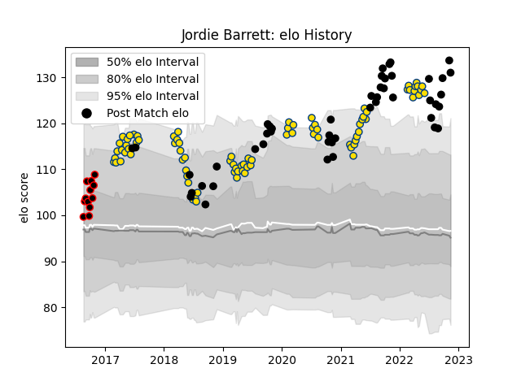

---  
layout: page  
title: Jordie Barrett  
date: 2022-11-15 23:43:07.150429  
categories: player  
---
# Jordie Barrett

## Positions: FB, C

## Country: New Zealand

## Current elo: 131.0

## Current Percentile: 99.0

# Elo History

# Match History

| Team        |   Appearances |   Win Rate |
|:------------|--------------:|-----------:|
| Hurricanes  |            85 |   0.647059 |
| New Zealand |            47 |   0.744681 |
| Canterbury  |            12 |   0.833333 |

| Opponent                 |   Matches |   Win Rate |
|:-------------------------|----------:|-----------:|
| Chiefs                   |        13 |   0.5      |
| Crusaders                |        13 |   0.230769 |
| Australia                |        11 |   0.863636 |
| Highlanders              |        11 |   0.818182 |
| Blues                    |         9 |   0.666667 |
| Argentina                |         7 |   0.714286 |
| Brumbies                 |         6 |   0.333333 |
| Ireland                  |         5 |   0.4      |
| Melbourne Rebels         |         5 |   1        |
| South Africa             |         5 |   0.4      |
| France                   |         4 |   0.75     |
| New South Wales Waratahs |         4 |   1        |
| Queensland Reds          |         4 |   1        |
| Stormers                 |         3 |   0.666667 |
| Sharks                   |         3 |   1        |
| Wales                    |         3 |   1        |
| Jaguares                 |         3 |   0.666667 |
| Sunwolves                |         2 |   1        |
| Tasman                   |         2 |   1        |
| Tonga                    |         2 |   1        |
| Lions                    |         2 |   0.5      |
| Western Force            |         2 |   1        |
| British and Irish Lions  |         2 |   0.5      |
| Bulls                    |         2 |   1        |
| Italy                    |         2 |   1        |
| Counties Manukau         |         2 |   0.5      |
| Fiji                     |         1 |   1        |
| Waikato                  |         1 |   1        |
| Canada                   |         1 |   1        |
| Taranaki                 |         1 |   1        |
| Cheetahs                 |         1 |   1        |
| England                  |         1 |   0        |
| Auckland                 |         1 |   1        |
| Manawatu                 |         1 |   0        |
| Samoa                    |         1 |   1        |
| Hawke's Bay              |         1 |   1        |
| Otago                    |         1 |   1        |
| Northland                |         1 |   1        |
| North Harbour            |         1 |   1        |
| Namibia                  |         1 |   1        |
| Moana Pasifika           |         1 |   0        |
| Japan                    |         1 |   1        |
| Scotland                 |         1 |   1        |