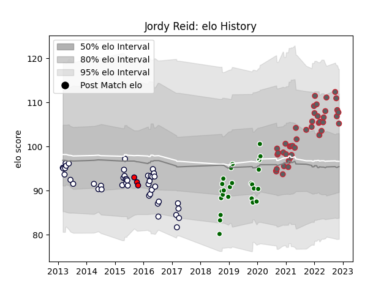

---  
layout: page  
title: Jordy Reid  
date: 2023-03-17 17:24:25.689669  
categories: player  
---
# Jordy Reid

## Positions: FL

## Current elo: 98.0

## Current Percentile: 65.0

# Elo History

# Match History

| Team                |   Appearances |   Win Rate |
|:--------------------|--------------:|-----------:|
| Gloucester Rugby    |            50 |   0.48     |
| Melbourne Rebels    |            44 |   0.363636 |
| Ealing Trailfinders |            26 |   0.788462 |
| Melbourne Rising    |            17 |   0.470588 |

| Opponent                 |   Matches |   Win Rate |
|:-------------------------|----------:|-----------:|
| Queensland Reds          |         5 |   0.6      |
| Bath Rugby               |         5 |   0.6      |
| Saracens                 |         5 |   0.4      |
| Northampton Saints       |         5 |   0.6      |
| Harlequins               |         4 |   0        |
| Highlanders              |         4 |   0.25     |
| London Irish             |         4 |   0.5      |
| New South Wales Waratahs |         4 |   0.25     |
| Newcastle Falcons        |         4 |   0.5      |
| Leicester Tigers         |         4 |   0.25     |
| Brumbies                 |         4 |   0.25     |
| Bristol Rugby            |         4 |   0.5      |
| Wasps                    |         4 |   0.75     |
| Western Force            |         4 |   0.75     |
| Exeter Chiefs            |         4 |   0.25     |
| Sale Sharks              |         3 |   0        |
| NSW Country Eagles       |         3 |   0.333333 |
| Stormers                 |         3 |   0.333333 |
| Jersey                   |         3 |   1        |
| Yorkshire Carnegie       |         3 |   1        |
| Bulls                    |         3 |   0.333333 |
| Doncaster                |         3 |   1        |
| Canberra Vikings         |         3 |   0.333333 |
| Cornish Pirates          |         3 |   0.666667 |
| Chiefs                   |         3 |   0.333333 |
| Blues                    |         3 |   0.333333 |
| Greater Sydney Rams      |         2 |   0.5      |
| Cheetahs                 |         2 |   0.5      |
| Brisbane City            |         2 |   0.5      |
| Queensland Country       |         2 |   1        |
| Perth Spirit             |         2 |   0        |
| Hartpury College         |         2 |   1        |
| Nottingham               |         2 |   0.5      |
| Sharks                   |         2 |   0        |
| North Harbour Rays       |         2 |   0.5      |
| London Scottish          |         2 |   1        |
| Coventry                 |         2 |   0.75     |
| Bedford                  |         2 |   0.5      |
| Hurricanes               |         2 |   0        |
| Ulster                   |         1 |   1        |
| Benetton Treviso         |         1 |   1        |
| Sunwolves                |         1 |   1        |
| Worcester Warriors       |         1 |   1        |
| Sydney Stars             |         1 |   1        |
| Perpignan                |         1 |   1        |
| Southern Kings           |         1 |   0        |
| Richmond                 |         1 |   1        |
| Cheethas                 |         1 |   1        |
| Lions                    |         1 |   0        |
| Crusaders                |         1 |   0        |
| La Rochelle              |         1 |   0        |
| Dragons                  |         1 |   1        |
| Ampthill                 |         1 |   1        |