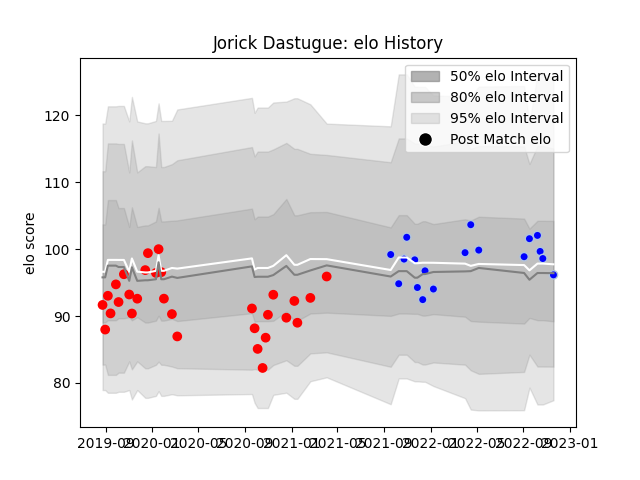

---  
layout: page  
title: Jorick Dastugue  
date: 2023-01-13 11:34:12.206354  
categories: player  
---
# Jorick Dastugue

## Positions: N8, FL

## Current elo: 99.0

## Current Percentile: 36.0

# Elo History

# Match History

| Team      |   Appearances |   Win Rate |
|:----------|--------------:|-----------:|
| Rouen     |            36 |   0.291667 |
| Colomiers |            26 |   0.5      |

| Opponent                   |   Matches |   Win Rate |
|:---------------------------|----------:|-----------:|
| Beziers                    |         7 |   0.571429 |
| Carcassonne                |         5 |   0.4      |
| Montauban                  |         5 |   0.2      |
| Vannes                     |         4 |   0.5      |
| Colomiers                  |         4 |   0        |
| Mont-de-Marsan             |         4 |   0        |
| Nevers                     |         4 |   0.25     |
| Grenoble                   |         3 |   0.666667 |
| Aurillac                   |         3 |   0.333333 |
| Soyaux-Angouleme           |         3 |   0.333333 |
| Rouen                      |         2 |   0.5      |
| Valence Romans Drome Rugby |         2 |   0.5      |
| US Bressane                |         2 |   0.5      |
| Roval Drome XV             |         2 |   1        |
| Agen                       |         2 |   0.5      |
| Provence Rugby             |         2 |   0.25     |
| Perpignan                  |         2 |   0.5      |
| Oyonnax                    |         2 |   0        |
| Biarritz Olympique         |         2 |   0        |
| Bayonne                    |         1 |   1        |
| Narbonne                   |         1 |   1        |