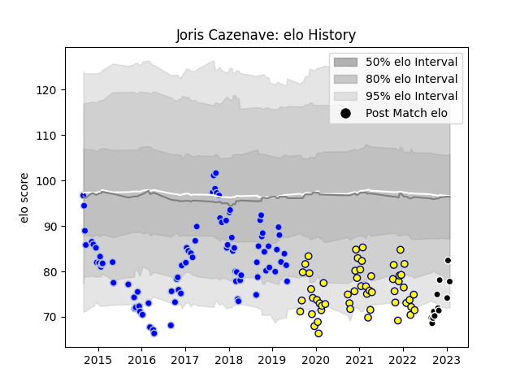

---  
layout: page  
title: Joris Cazenave  
date: 2023-02-02 18:53:36.626943  
categories: player  
---
# Joris Cazenave

## Positions: SH

## Current elo: 78.0

## Current Percentile: 14.0

# Elo History

# Match History

| Team           |   Appearances |   Win Rate |
|:---------------|--------------:|-----------:|
| Colomiers      |            86 |   0.436047 |
| Nevers         |            54 |   0.574074 |
| Provence Rugby |            12 |   0.375    |

| Opponent           |   Matches |   Win Rate |
|:-------------------|----------:|-----------:|
| Beziers            |        13 |   0.384615 |
| Carcassonne        |        12 |   0.416667 |
| Aurillac           |        10 |   0.5      |
| Narbonne           |         9 |   0.833333 |
| Biarritz Olympique |         9 |   0.666667 |
| Montauban          |         9 |   0.444444 |
| Soyaux-Angouleme   |         9 |   0.611111 |
| Mont-de-Marsan     |         8 |   0.5      |
| Vannes             |         7 |   0.285714 |
| Provence Rugby     |         7 |   0.714286 |
| Perpignan          |         7 |   0.642857 |
| Colomiers          |         6 |   0.166667 |
| Grenoble           |         6 |   0.666667 |
| Dax                |         5 |   0.6      |
| Bayonne            |         5 |   0.1      |
| Rouen              |         4 |   0.75     |
| Nevers             |         4 |   0        |
| Oyonnax            |         4 |   0.25     |
| US Bressane        |         3 |   0.666667 |
| Agen               |         3 |   0.666667 |
| Massy              |         3 |   0.333333 |
| Albi               |         2 |   0        |
| Tarbes             |         2 |   0.5      |
| Bourgoin-Jallieu   |         2 |   0.5      |
| Pau                |         1 |   0        |
| Lyon               |         1 |   0        |
| Brive              |         1 |   0        |