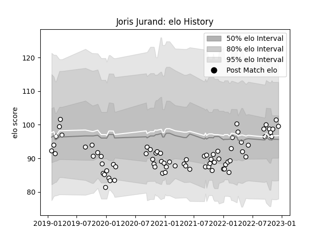

---  
layout: page  
title: Joris Jurand  
date: 2022-12-14 11:30:04.062435  
categories: player  
---
# Joris Jurand

## Positions: FB, W

## Current elo: 100.0

## Current Percentile: 71.0

# Elo History

# Match History

| Team   |   Appearances |   Win Rate |
|:-------|--------------:|-----------:|
| Brive  |            76 |   0.394737 |

| Opponent             |   Matches |   Win Rate |
|:---------------------|----------:|-----------:|
| Pau                  |         7 |   0.571429 |
| Montpellier Herault  |         6 |   0.25     |
| Stade Toulousain     |         6 |   0.166667 |
| Stade Francais Paris |         6 |   0.666667 |
| Racing 92            |         6 |   0.166667 |
| Toulon               |         5 |   0.4      |
| Lyon                 |         5 |   0.4      |
| Castres Olympique    |         4 |   0.25     |
| Clermont Auvergne    |         4 |   0.25     |
| La Rochelle          |         4 |   0.25     |
| Zebre                |         3 |   0.333333 |
| Perpignan            |         3 |   0.666667 |
| Agen                 |         2 |   0.5      |
| Bayonne              |         2 |   0.75     |
| Bordeaux Begles      |         2 |   0        |
| Biarritz Olympique   |         2 |   0.5      |
| Montauban            |         1 |   0        |
| Nevers               |         1 |   1        |
| Massy                |         1 |   1        |
| Leicester Tigers     |         1 |   0        |
| Provence Rugby       |         1 |   1        |
| Cardiff Blues        |         1 |   0        |
| Beziers              |         1 |   0        |
| Vannes               |         1 |   1        |
| Mont-de-Marsan       |         1 |   1        |