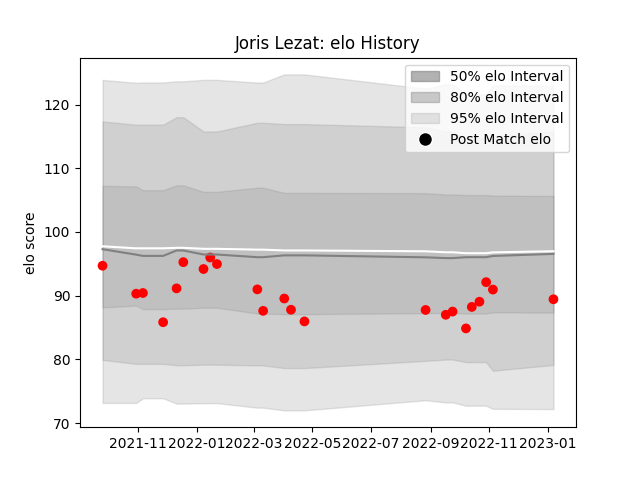

---  
layout: page  
title: Joris Lezat  
date: 2023-01-13 11:30:59.847716  
categories: player  
---
# Joris Lezat

## Positions: SH

## Current elo: 89.0

## Current Percentile: 38.0

# Elo History

# Match History

| Team   |   Appearances |   Win Rate |
|:-------|--------------:|-----------:|
| Rouen  |            23 |   0.304348 |

| Opponent           |   Matches |   Win Rate |
|:-------------------|----------:|-----------:|
| Agen               |         3 |          0 |
| Montauban          |         2 |          0 |
| Oyonnax            |         2 |          0 |
| Nevers             |         2 |          0 |
| Vannes             |         2 |          1 |
| Carcassonne        |         1 |          0 |
| Colomiers          |         1 |          0 |
| Grenoble           |         1 |          0 |
| Aurillac           |         1 |          0 |
| Mont-de-Marsan     |         1 |          1 |
| Biarritz Olympique |         1 |          1 |
| Beziers            |         1 |          0 |
| Bayonne            |         1 |          0 |
| Provence Rugby     |         1 |          1 |
| Soyaux-Angouleme   |         1 |          1 |
| US Bressane        |         1 |          0 |
| Massy              |         1 |          1 |