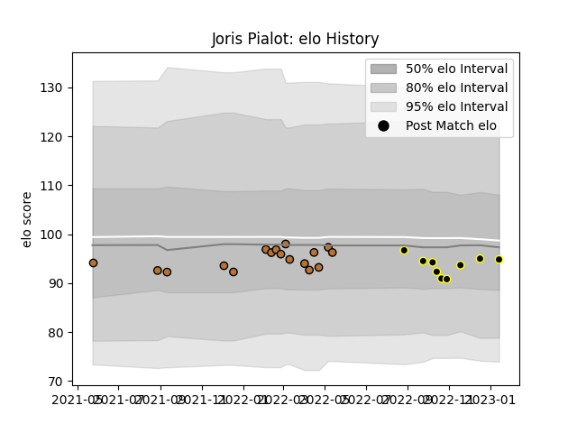

---  
layout: page  
title: Joris Pialot  
date: 2023-02-02 19:01:46.313683  
categories: player  
---
# Joris Pialot

## Positions: FH

## Current elo: 101.0

## Current Percentile: 40.0

# Elo History

# Match History

| Team           |   Appearances |   Win Rate |
|:---------------|--------------:|-----------:|
| Narbonne       |            17 |   0.235294 |
| Mont-de-Marsan |            10 |   0.5      |

| Opponent         |   Matches |   Win Rate |
|:-----------------|----------:|-----------:|
| Oyonnax          |         3 |   0.333333 |
| Montauban        |         3 |   0        |
| Vannes           |         2 |   0.25     |
| US Bressane      |         2 |   0.5      |
| Carcassonne      |         2 |   0.5      |
| Rouen            |         2 |   0.5      |
| Provence Rugby   |         2 |   0.5      |
| Massy            |         2 |   0.5      |
| Nevers           |         1 |   0        |
| Soyaux-Angouleme |         1 |   1        |
| Agen             |         1 |   0        |
| Aurillac         |         1 |   1        |
| Grenoble         |         1 |   0.5      |
| Colomiers        |         1 |   0        |
| Beziers          |         1 |   0        |
| Bayonne          |         1 |   0        |
| Mont-de-Marsan   |         1 |   0        |