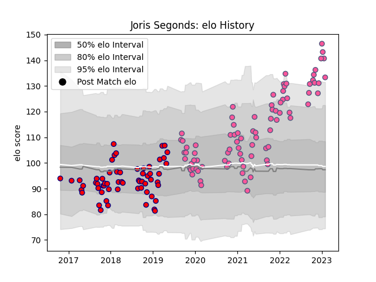

---  
layout: page  
title: Joris Segonds  
date: 2022-12-09 13:08:12.133158  
categories: player  
---
# Joris Segonds

## Positions: FH

## Current elo: 123.0

## Current Percentile: 93.0

# Elo History

# Match History

| Team                 |   Appearances |   Win Rate |
|:---------------------|--------------:|-----------:|
| Stade Francais Paris |            75 |   0.48     |
| Aurillac             |            41 |   0.512195 |

| Opponent            |   Matches |   Win Rate |
|:--------------------|----------:|-----------:|
| Brive               |         8 |   0.5      |
| Bayonne             |         7 |   0.571429 |
| Clermont Auvergne   |         6 |   0.333333 |
| La Rochelle         |         6 |   0.666667 |
| Toulon              |         6 |   0.333333 |
| Stade Toulousain    |         6 |   0.75     |
| Montpellier Herault |         6 |   0.25     |
| Pau                 |         5 |   0.6      |
| Racing 92           |         5 |   0.2      |
| Castres Olympique   |         5 |   0.6      |
| Bordeaux Begles     |         4 |   0.25     |
| Lyon                |         4 |   0.5      |
| Massy               |         4 |   0.75     |
| Soyaux-Angouleme    |         3 |   0.666667 |
| Perpignan           |         3 |   1        |
| Vannes              |         3 |   0.333333 |
| Agen                |         3 |   0.666667 |
| Mont-de-Marsan      |         3 |   0.333333 |
| Colomiers           |         3 |   0.333333 |
| Carcassonne         |         3 |   0.333333 |
| Biarritz Olympique  |         3 |   0.333333 |
| Beziers             |         3 |   0.666667 |
| Montauban           |         2 |   0.5      |
| Nevers              |         2 |   0        |
| Grenoble            |         2 |   0.5      |
| Dax                 |         2 |   0.5      |
| Provence Rugby      |         2 |   0.5      |
| Bristol Rugby       |         2 |   0        |
| Zebre               |         2 |   0.5      |
| Narbonne            |         1 |   1        |
| Oyonnax             |         1 |   1        |
| US Bressane         |         1 |   1        |