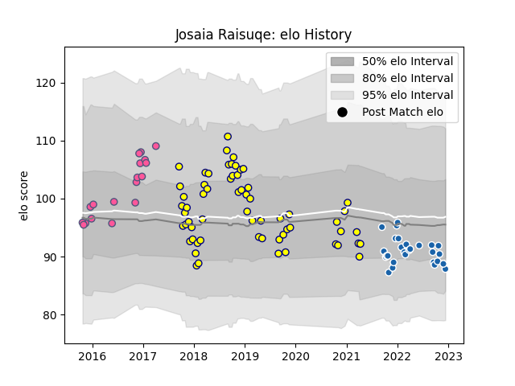

---  
layout: page  
title: Josaia Raisuqe  
date: 2022-12-18 16:15:50.849607  
categories: player  
---
# Josaia Raisuqe

## Positions: W

## Current elo: 88.0

## Current Percentile: 27.0

# Elo History

# Match History

| Team                 |   Appearances |   Win Rate |
|:---------------------|--------------:|-----------:|
| Nevers               |            62 |   0.620968 |
| Castres Olympique    |            29 |   0.517241 |
| Stade Francais Paris |            18 |   0.444444 |

| Opponent             |   Matches |   Win Rate |
|:---------------------|----------:|-----------:|
| Bayonne              |         6 |   0.666667 |
| Biarritz Olympique   |         6 |   0.666667 |
| Carcassonne          |         6 |   0.5      |
| Montauban            |         6 |   0.5      |
| Beziers              |         4 |   0.375    |
| Racing 92            |         4 |   0.25     |
| Perpignan            |         4 |   0.75     |
| Clermont Auvergne    |         4 |   0.5      |
| Mont-de-Marsan       |         4 |   0.75     |
| Aurillac             |         4 |   0.75     |
| Massy                |         3 |   0.666667 |
| La Rochelle          |         3 |   0.333333 |
| Stade Francais Paris |         3 |   0.666667 |
| Soyaux-Angouleme     |         3 |   0.666667 |
| Oyonnax              |         3 |   0.333333 |
| Montpellier Herault  |         3 |   0.666667 |
| Vannes               |         3 |   0.333333 |
| Grenoble             |         3 |   0.333333 |
| Edinburgh            |         3 |   0.333333 |
| Colomiers            |         3 |   1        |
| Bordeaux Begles      |         3 |   0        |
| Brive                |         3 |   0.666667 |
| Harlequins           |         2 |   0.5      |
| Rouen                |         2 |   1        |
| Toulon               |         2 |   0        |
| Dax                  |         2 |   0.5      |
| Narbonne             |         2 |   1        |
| Stade Toulousain     |         2 |   0.5      |
| US Bressane          |         1 |   1        |
| Timisoara Saracens   |         1 |   1        |
| Benetton Treviso     |         1 |   1        |
| Roval Drome XV       |         1 |   1        |
| Castres Olympique    |         1 |   0        |
| Provence Rugby       |         1 |   1        |
| Leicester Tigers     |         1 |   0        |
| Pau                  |         1 |   1        |
| Ospreys              |         1 |   1        |
| Munster              |         1 |   1        |
| Exeter Chiefs        |         1 |   0        |
| Lyon                 |         1 |   1        |
| Agen                 |         1 |   0        |