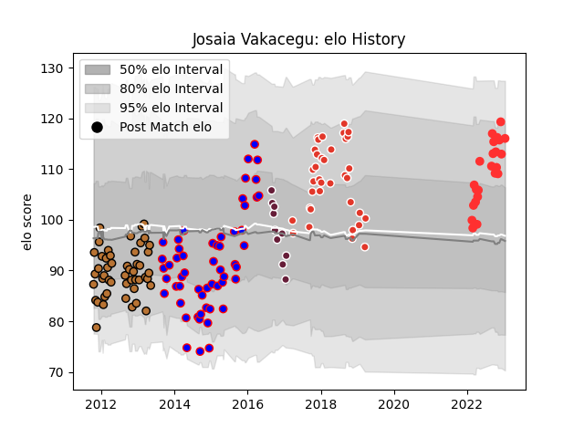

---  
layout: page  
title: Josaia Vakacegu  
date: 2023-01-17 11:28:33.346643  
categories: player  
---
# Josaia Vakacegu

## Positions: C, W

## Current elo: 116.0

## Current Percentile: 84.0

# Elo History

# Match History

| Team               |   Appearances |   Win Rate |
|:-------------------|--------------:|-----------:|
| Beziers            |            55 |   0.490909 |
| Narbonne           |            49 |   0.428571 |
| Biarritz Olympique |            36 |   0.569444 |
| Tarbes             |            23 |   0.478261 |
| Bordeaux Begles    |            10 |   0.4      |

| Opponent                   |   Matches |   Win Rate |
|:---------------------------|----------:|-----------:|
| Dax                        |        10 |   0.3      |
| Colomiers                  |        10 |   0.7      |
| Albi                       |         9 |   0.833333 |
| Carcassonne                |         9 |   0.666667 |
| Massy                      |         8 |   0.5      |
| Mont-de-Marsan             |         8 |   0.4375   |
| Tarbes                     |         7 |   0.428571 |
| Pau                        |         7 |   0.285714 |
| Narbonne                   |         7 |   0.571429 |
| Montauban                  |         6 |   0.5      |
| Auch                       |         6 |   0.416667 |
| Beziers                    |         6 |   0.583333 |
| Bourgoin-Jallieu           |         5 |   0.4      |
| Provence Rugby             |         5 |   0.6      |
| Aurillac                   |         5 |   0.4      |
| La Rochelle                |         4 |   0.5      |
| US Bressane                |         4 |   0.25     |
| Agen                       |         4 |   0.5      |
| Lyon                       |         4 |   0.25     |
| Bayonne                    |         4 |   0.75     |
| Grenoble                   |         3 |   0.333333 |
| Brive                      |         3 |   0.5      |
| Soyaux-Angouleme           |         3 |   0.333333 |
| Oyonnax                    |         3 |   0.333333 |
| Perpignan                  |         3 |   0.333333 |
| Cognac Saint Jean d'Angély |         3 |   1        |
| Clermont Auvergne          |         3 |   0        |
| Vannes                     |         2 |   0        |
| Nevers                     |         2 |   1        |
| Nice                       |         2 |   0        |
| Chambery                   |         2 |   0.5      |
| Blagnac                    |         2 |   0        |
| Exeter Chiefs              |         2 |   0.5      |
| Biarritz Olympique         |         2 |   0.5      |
| Suresnes                   |         2 |   0        |
| Valence Romans Drome Rugby |         1 |   1        |
| Ulster                     |         1 |   1        |
| Aubenas                    |         1 |   1        |
| Montpellier Herault        |         1 |   0        |
| Stade Toulousain           |         1 |   0        |
| Carqueiranne-Hyères        |         1 |   0        |
| Périgueux                  |         1 |   1        |
| Rennes                     |         1 |   1        |