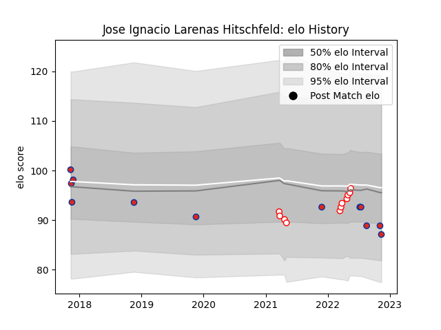

---  
layout: page  
title: Jose Ignacio Larenas Hitschfeld  
date: 2022-11-16 11:41:32.332620  
categories: player  
---
# Jose Ignacio Larenas Hitschfeld

## Positions: C

## Country: Chile

## Current elo: 87.0

## Current Percentile: 23.0

# Elo History

# Match History

| Team    |   Appearances |   Win Rate |
|:--------|--------------:|-----------:|
| Chile   |            12 |   0.416667 |
| Selknam |            11 |   0.636364 |

| Opponent                 |   Matches |   Win Rate |
|:-------------------------|----------:|-----------:|
| Cobras                   |         3 |   0.666667 |
| Jaguares XV              |         3 |   0.333333 |
| Olimpia Lions            |         3 |   0.666667 |
| Russia                   |         2 |   0.5      |
| United States of America |         2 |   0.5      |
| Brazil                   |         1 |   1        |
| Cafeteros Pro            |         1 |   1        |
| Germany                  |         1 |   1        |
| Hong Kong                |         1 |   0        |
| Kenya                    |         1 |   1        |
| New Zealand Maori        |         1 |   0        |
| Penarol Rugby            |         1 |   1        |
| Portugal                 |         1 |   0        |
| Romania                  |         1 |   0        |
| Tonga                    |         1 |   0        |