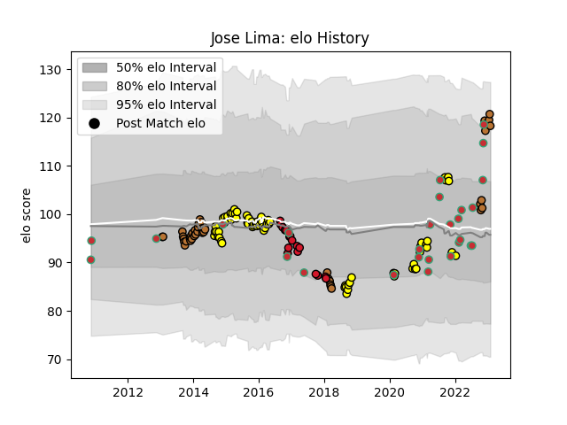

---  
layout: page  
title: Jose Lima  
date: 2022-11-22 11:35:58.819420  
categories: player  
---
# Jose Lima

## Positions: C

## Country: Portugal

## Current elo: 106.0

## Current Percentile: 81.0

# Elo History

# Match History

| Team        |   Appearances |   Win Rate |
|:------------|--------------:|-----------:|
| Carcassonne |            61 |   0.491803 |
| Narbonne    |            28 |   0.535714 |
| Portugal    |            25 |   0.56     |
| Oyonnax     |            14 |   0.5      |

| Opponent                   |   Matches |   Win Rate |
|:---------------------------|----------:|-----------:|
| Beziers                    |         8 |   0.5      |
| Mont-de-Marsan             |         8 |   0.375    |
| Biarritz Olympique         |         7 |   0.428571 |
| Perpignan                  |         6 |   0.166667 |
| Bourgoin-Jallieu           |         5 |   0.4      |
| Narbonne                   |         5 |   0.6      |
| Pau                        |         4 |   0.75     |
| Dax                        |         4 |   1        |
| Aurillac                   |         4 |   0.5      |
| US Bressane                |         4 |   1        |
| Soyaux-Angouleme           |         3 |   0.666667 |
| Georgia                    |         3 |   0.166667 |
| Tarbes                     |         3 |   0.666667 |
| Montauban                  |         3 |   0.333333 |
| Massy                      |         3 |   0.666667 |
| Lyon                       |         3 |   0.333333 |
| Albi                       |         3 |   1        |
| Agen                       |         3 |   0.666667 |
| Vannes                     |         3 |   0.666667 |
| Brazil                     |         3 |   1        |
| Colomiers                  |         3 |   0.666667 |
| Bayonne                    |         3 |   0.333333 |
| Carcassonne                |         3 |   0.666667 |
| Nevers                     |         2 |   0        |
| Brive                      |         2 |   0        |
| Provence Rugby             |         2 |   0.5      |
| Belgium                    |         2 |   0.5      |
| Oyonnax                    |         2 |   0        |
| Netherlands                |         2 |   1        |
| Spain                      |         2 |   0.5      |
| Namibia                    |         2 |   1        |
| La Rochelle                |         2 |   0        |
| United States of America   |         2 |   0.25     |
| Romania                    |         2 |   0        |
| Russia                     |         1 |   1        |
| Auch                       |         1 |   1        |
| Argentina                  |         1 |   0        |
| Valence Romans Drome Rugby |         1 |   0        |
| Grenoble                   |         1 |   1        |
| Hong Kong                  |         1 |   1        |
| Canada                     |         1 |   1        |
| Chambery                   |         1 |   0        |
| Connacht                   |         1 |   0        |
| Japan                      |         1 |   0        |
| Italy                      |         1 |   0        |
| Kenya                      |         1 |   1        |