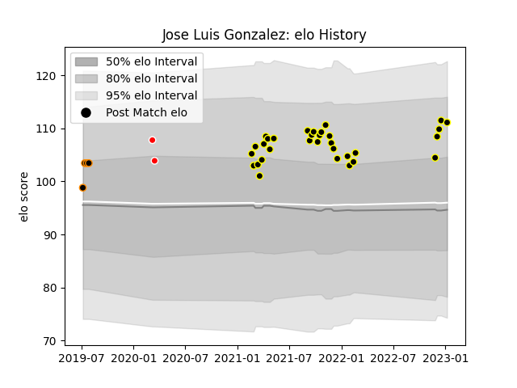

---  
layout: page  
title: Jose Luis Gonzalez  
date: 2022-12-09 13:11:55.153655  
categories: player  
---
# Jose Luis Gonzalez

## Positions: H

## Current elo: 105.0

## Current Percentile: 76.0

# Elo History

# Match History

| Team           |   Appearances |   Win Rate |
|:---------------|--------------:|-----------:|
| Mont-de-Marsan |            14 |   0.607143 |
| Ceibos Rugby   |             2 |   1        |
| Jaguares XV    |             2 |   1        |

| Opponent                   |   Matches |   Win Rate |
|:---------------------------|----------:|-----------:|
| Vannes                     |         3 |   0.333333 |
| Oyonnax                    |         2 |   0.5      |
| Aurillac                   |         1 |   1        |
| Beziers                    |         1 |   1        |
| Boland Cavaliers           |         1 |   1        |
| Carcassonne                |         1 |   1        |
| Colomiers                  |         1 |   1        |
| Grenoble                   |         1 |   0        |
| Griffons                   |         1 |   1        |
| Nevers                     |         1 |   1        |
| Olimpia Lions              |         1 |   1        |
| Provence Rugby             |         1 |   1        |
| Selknam                    |         1 |   1        |
| Soyaux-Angouleme           |         1 |   0        |
| Valence Romans Drome Rugby |         1 |   0.5      |