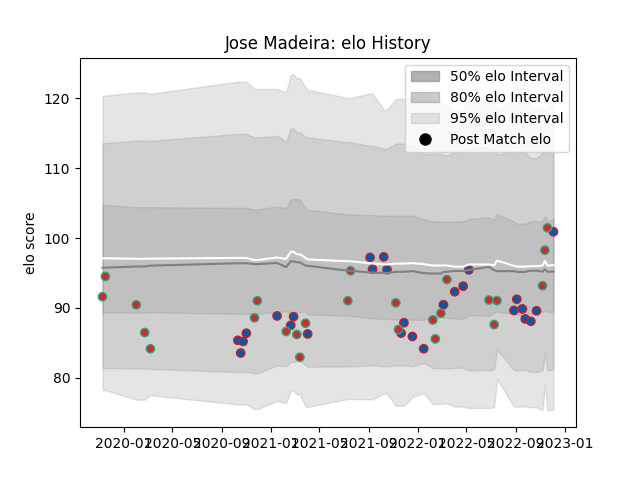

---  
layout: page  
title: Jose Madeira  
date: 2022-11-22 11:46:02.680414  
categories: player  
---
# Jose Madeira

## Positions: L, FL

## Country: Portugal

## Current elo: 96.0

## Current Percentile: 60.0

# Elo History

# Match History

| Team     |   Appearances |   Win Rate |
|:---------|--------------:|-----------:|
| Grenoble |            26 |   0.615385 |
| Portugal |            25 |   0.48     |

| Opponent                   |   Matches |   Win Rate |
|:---------------------------|----------:|-----------:|
| Vannes                     |         4 |   0.25     |
| Georgia                    |         4 |   0.125    |
| Spain                      |         3 |   0.333333 |
| Brazil                     |         3 |   0.666667 |
| Russia                     |         2 |   0.5      |
| Rouen                      |         2 |   1        |
| Romania                    |         2 |   0        |
| Netherlands                |         2 |   1        |
| Mont-de-Marsan             |         2 |   0.5      |
| Agen                       |         2 |   1        |
| Carcassonne                |         2 |   0.5      |
| Aurillac                   |         2 |   1        |
| Beziers                    |         2 |   0.5      |
| Chile                      |         1 |   1        |
| Provence Rugby             |         1 |   0        |
| Valence Romans Drome Rugby |         1 |   1        |
| United States of America   |         1 |   0.5      |
| US Bressane                |         1 |   0        |
| Soyaux-Angouleme           |         1 |   1        |
| Belgium                    |         1 |   1        |
| Biarritz Olympique         |         1 |   0        |
| Perpignan                  |         1 |   0        |
| Hong Kong                  |         1 |   1        |
| Oyonnax                    |         1 |   1        |
| Nevers                     |         1 |   1        |
| Canada                     |         1 |   1        |
| Narbonne                   |         1 |   1        |
| Argentina                  |         1 |   0        |
| Kenya                      |         1 |   1        |
| Japan                      |         1 |   0        |
| Italy                      |         1 |   0        |
| Montauban                  |         1 |   1        |