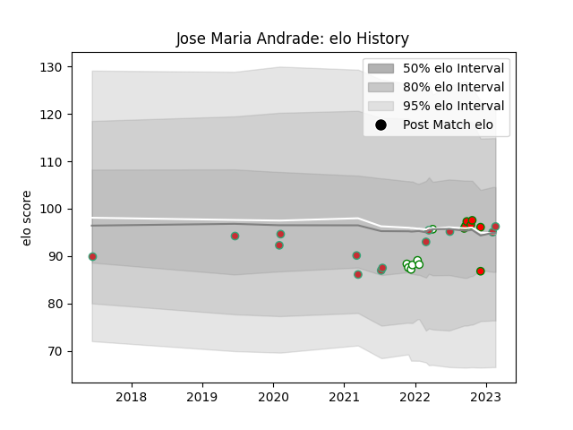

---  
layout: page  
title: Jose Maria Andrade  
date: 2023-02-28 13:54:22.607116  
categories: player  
---
# Jose Maria Andrade

## Positions: L

## Country: Portugal

## Current elo: 96.0

## Current Percentile: 54.0

# Elo History

# Match History

| Team         |   Appearances |   Win Rate |
|:-------------|--------------:|-----------:|
| Portugal     |            13 |   0.615385 |
| Lusitanos XV |             7 |   0.571429 |
| Nottingham   |             7 |   0.142857 |

| Opponent                 |   Matches |   Win Rate |
|:-------------------------|----------:|-----------:|
| Romania                  |         3 |   0.666667 |
| Tel-Aviv Heat            |         2 |   0        |
| Belgium                  |         2 |   1        |
| Brussels Devils          |         2 |   1        |
| Castilla y Leon Iberians |         2 |   0.5      |
| Doncaster                |         2 |   0        |
| Netherlands              |         2 |   1        |
| Italy                    |         1 |   0        |
| Spain                    |         1 |   0        |
| Russia                   |         1 |   1        |
| London Scottish          |         1 |   1        |
| Ampthill                 |         1 |   0        |
| Germany                  |         1 |   1        |
| Georgia                  |         1 |   0        |
| Bedford                  |         1 |   0        |
| Delta                    |         1 |   1        |
| Cornish Pirates          |         1 |   0        |
| Brazil                   |         1 |   0        |
| Ealing Trailfinders      |         1 |   0        |