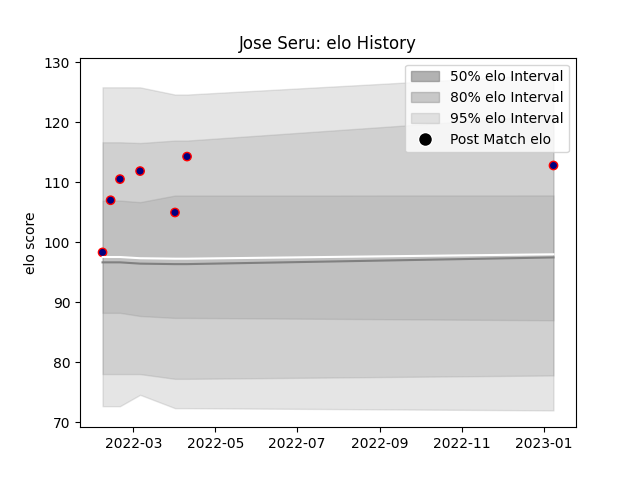

---  
layout: page  
title: Jose Seru  
date: 2023-01-13 11:29:33.339263  
categories: player  
---
# Jose Seru

## Positions: N8

## Current elo: 113.0

## Current Percentile: 84.0

# Elo History

# Match History

| Team                     |   Appearances |   Win Rate |
|:-------------------------|--------------:|-----------:|
| Hanazono Kintetsu Liners |             7 |   0.857143 |

| Opponent                          |   Matches |   Win Rate |
|:----------------------------------|----------:|-----------:|
| Hino Red Dolphins                 |         2 |          1 |
| Kamaishi Seawaves                 |         2 |          1 |
| Skyactivs Hiroshima               |         2 |          1 |
| Kubota Spears Funabashi Tokyo-Bay |         1 |          0 |