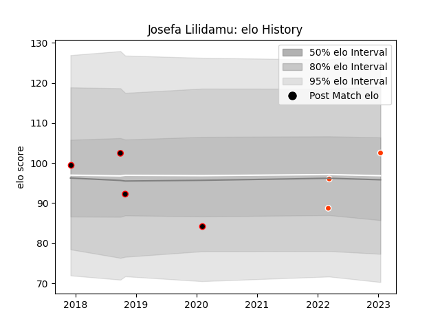

---  
layout: page  
title: Josefa Lilidamu  
date: 2023-01-17 11:29:03.354996  
categories: player  
---
# Josefa Lilidamu

## Positions: W, C

## Current elo: 103.0

## Current Percentile: 50.0

# Elo History

# Match History

| Team                            |   Appearances |   Win Rate |
|:--------------------------------|--------------:|-----------:|
| NTT Docomo Red Hurricanes Osaka |             4 |   0.5      |
| Hino Red Dolphins               |             3 |   0.333333 |

| Opponent              |   Matches |   Win Rate |
|:----------------------|----------:|-----------:|
| Mie Honda Heat        |         2 |          0 |
| Black Rams Tokyo      |         1 |          0 |
| Chugoku Red Regulions |         1 |          1 |
| Kamaishi Seawaves     |         1 |          1 |
| Kobelco Kobe Steelers |         1 |          0 |
| Mazda Blue Zoomers    |         1 |          1 |