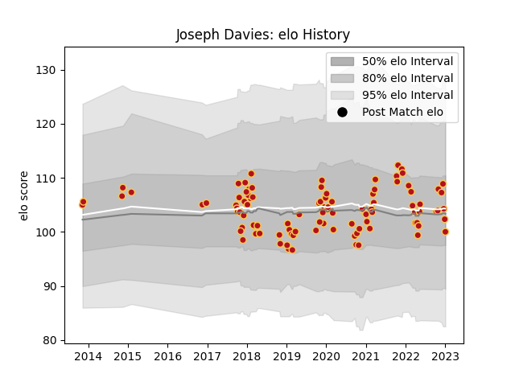

---  
layout: page  
title: Joseph Davies  
date: 2022-12-14 11:22:47.055678  
categories: player  
---
# Joseph Davies

## Positions: L

## Current elo: 93.0

## Current Percentile: 25.0

# Elo History

# Match History

| Team    |   Appearances |   Win Rate |
|:--------|--------------:|-----------:|
| Dragons |            95 |   0.321053 |

| Opponent           |   Matches |   Win Rate |
|:-------------------|----------:|-----------:|
| Scarlets           |        10 |  0.4       |
| Ospreys            |         9 |  0.5       |
| Benetton Treviso   |         7 |  0.214286  |
| Ulster             |         7 |  0.0714286 |
| Edinburgh          |         5 |  0.2       |
| Munster            |         5 |  0         |
| Glasgow Warriors   |         5 |  0.5       |
| Zebre              |         5 |  0.4       |
| Cardiff Blues      |         5 |  0         |
| RC Enisei          |         4 |  1         |
| Worcester Warriors |         4 |  0.75      |
| Leinster           |         4 |  0         |
| Connacht           |         3 |  0.333333  |
| Bordeaux Begles    |         2 |  0.5       |
| Lions              |         2 |  0.25      |
| Castres Olympique  |         2 |  0.5       |
| Newcastle Falcons  |         2 |  0         |
| Cheetahs           |         2 |  0.5       |
| Southern Kings     |         2 |  0.5       |
| Timisoara Saracens |         1 |  1         |
| Exeter Chiefs      |         1 |  0         |
| Wasps              |         1 |  1         |
| Bristol Rugby      |         1 |  0         |
| Harlequins         |         1 |  0         |
| Stormers           |         1 |  0         |
| Sharks             |         1 |  0         |
| Leicester Tigers   |         1 |  0         |
| Clermont Auvergne  |         1 |  0         |
| Bulls              |         1 |  0         |