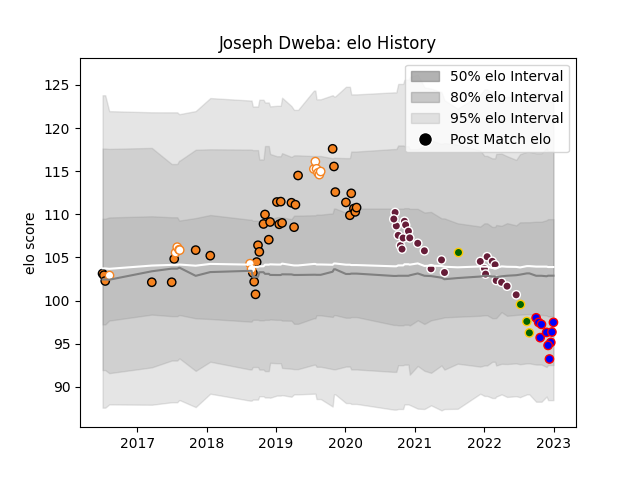

---  
layout: page  
title: Joseph Dweba  
date: 2022-12-18 16:12:43.159466  
categories: player  
---
# Joseph Dweba

## Positions: H

## Country: South Africa

## Current elo: 97.0

## Current Percentile: 51.0

# Elo History

# Match History

| Team                |   Appearances |   Win Rate |
|:--------------------|--------------:|-----------:|
| Cheetahs            |            35 |   0.385714 |
| Bordeaux Begles     |            25 |   0.42     |
| Free State Cheetahs |            10 |   0.6      |
| Stormers            |             8 |   0.6875   |
| South Africa        |             4 |   0.25     |

| Opponent            |   Matches |   Win Rate |
|:--------------------|----------:|-----------:|
| Southern Kings      |         7 |   1        |
| Cardiff Blues       |         4 |   0.25     |
| Zebre               |         3 |   0.666667 |
| La Rochelle         |         3 |   0        |
| Edinburgh           |         3 |   0.666667 |
| Dragons             |         3 |   0.666667 |
| Connacht            |         3 |   0        |
| Ospreys             |         3 |   0.166667 |
| Brive               |         3 |   0.666667 |
| Scarlets            |         3 |   0.666667 |
| Western Province    |         3 |   0.666667 |
| Pau                 |         2 |   0        |
| Stade Toulousain    |         2 |   0        |
| Natal Sharks        |         2 |   0.5      |
| Munster             |         2 |   0        |
| Toulon              |         2 |   0        |
| Ulster              |         2 |   0.25     |
| Montpellier Herault |         2 |   0.5      |
| Agen                |         2 |   1        |
| Glasgow Warriors    |         2 |   0        |
| Clermont Auvergne   |         2 |   0.25     |
| Blue Bulls          |         2 |   0.5      |
| Griquas             |         1 |   1        |
| Boland Cavaliers    |         1 |   1        |
| Australia           |         1 |   0        |
| Western Force       |         1 |   1        |
| Wales               |         1 |   0        |
| Bayonne             |         1 |   1        |
| Benetton Treviso    |         1 |   1        |
| Stormers            |         1 |   0        |
| Biarritz Olympique  |         1 |   1        |
| Sharks              |         1 |   0        |
| Bristol Rugby       |         1 |   0        |
| Racing 92           |         1 |   0        |
| Jaguares            |         1 |   0        |
| Bulls               |         1 |   0        |
| New Zealand         |         1 |   0        |
| Castres Olympique   |         1 |   1        |
| Lyon                |         1 |   0        |
| London Irish        |         1 |   1        |
| Lions               |         1 |   1        |
| Argentina           |         1 |   1        |
| Golden Lions        |         1 |   0        |
| Leinster            |         1 |   0        |