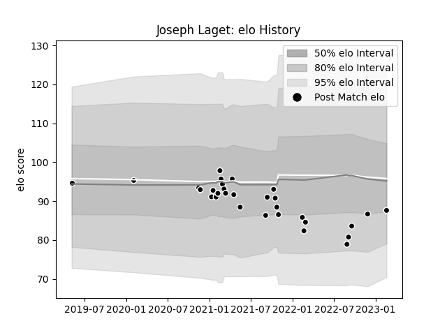

---  
layout: page  
title: Joseph Laget  
date: 2023-02-24 02:31:11.061810  
categories: player  
---
# Joseph Laget

## Positions: H, FL

## Current elo: 88.0

## Current Percentile: 16.0

# Elo History

# Match History

| Team           |   Appearances |   Win Rate |
|:---------------|--------------:|-----------:|
| Provence Rugby |            30 |       0.35 |

| Opponent                   |   Matches |   Win Rate |
|:---------------------------|----------:|-----------:|
| Aurillac                   |         3 |   0        |
| Carcassonne                |         3 |   0.666667 |
| Nevers                     |         3 |   0.333333 |
| Agen                       |         2 |   0.25     |
| Beziers                    |         2 |   0.5      |
| Biarritz Olympique         |         2 |   0        |
| Grenoble                   |         2 |   0.5      |
| Montauban                  |         2 |   0.5      |
| Perpignan                  |         2 |   0        |
| Soyaux-Angouleme           |         2 |   0.5      |
| Vannes                     |         2 |   0        |
| Bayonne                    |         1 |   0        |
| Colomiers                  |         1 |   1        |
| Oyonnax                    |         1 |   0        |
| US Bressane                |         1 |   1        |
| Valence Romans Drome Rugby |         1 |   1        |