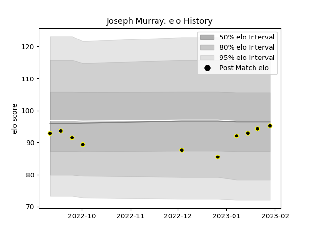

---  
layout: page  
title: Joseph Murray  
date: 2023-03-21 18:06:48.488672  
categories: player  
---
# Joseph Murray

Last updated: 2023-03-21
## Positions: SH

## Current elo: 88.0

## Current Percentile: 40.0

# Elo History

# Match History

| Team   |   Appearances |   Win Rate |
|:-------|--------------:|-----------:|
| Caldy  |            13 |   0.384615 |

| Opponent            |   Matches |   Win Rate |
|:--------------------|----------:|-----------:|
| Bedford             |         2 |        0.5 |
| Nottingham          |         2 |        0.5 |
| Richmond            |         2 |        1   |
| Ampthill            |         1 |        0   |
| Coventry            |         1 |        0   |
| Doncaster           |         1 |        0   |
| Ealing Trailfinders |         1 |        1   |
| Hartpury College    |         1 |        0   |
| Jersey              |         1 |        0   |
| London Scottish     |         1 |        0   |