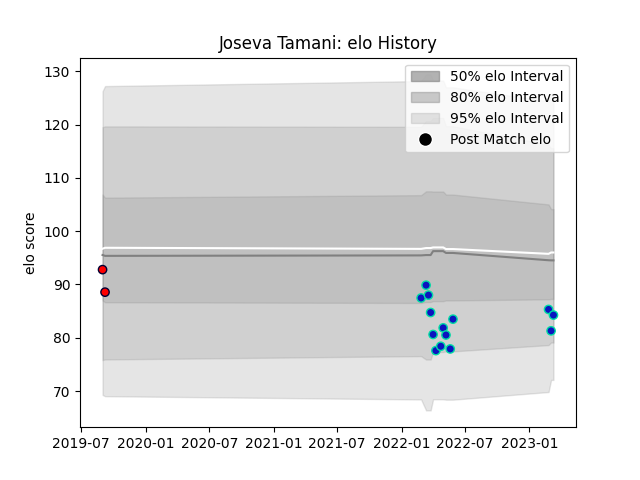

---  
layout: page  
title: Joseva Tamani  
date: 2023-03-17 17:04:28.212221  
categories: player  
---
# Joseva Tamani

## Positions: FL

## Current elo: 84.0

## Current Percentile: 13.0

# Elo History

# Match History

| Team             |   Appearances |   Win Rate |
|:-----------------|--------------:|-----------:|
| Fijian Drua      |            14 |   0.142857 |
| Melbourne Rising |             2 |   0        |

| Opponent                 |   Matches |   Win Rate |
|:-------------------------|----------:|-----------:|
| Brumbies                 |         2 |        0   |
| Crusaders                |         2 |        0.5 |
| New South Wales Waratahs |         2 |        0   |
| Blues                    |         1 |        0   |
| Canberra Vikings         |         1 |        0   |
| Chiefs                   |         1 |        0   |
| Highlanders              |         1 |        0   |
| Hurricanes               |         1 |        0   |
| Melbourne Rebels         |         1 |        0   |
| Moana Pasifika           |         1 |        1   |
| NSW Country Eagles       |         1 |        0   |
| Queensland Reds          |         1 |        0   |
| Western Force            |         1 |        0   |