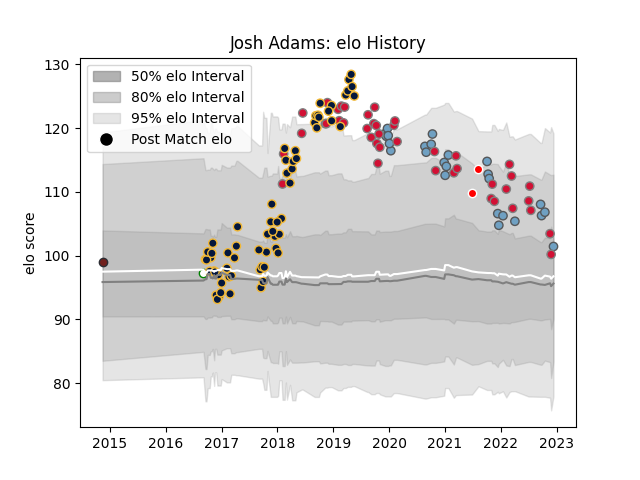

---  
layout: page  
title: Josh Adams  
date: 2023-02-02 18:45:57.297248  
categories: player  
---
# Josh Adams

## Positions: W, FB

## Country: Wales

## Current elo: 105.0

## Current Percentile: 71.0

# Elo History

# Match History

| Team                    |   Appearances |   Win Rate |
|:------------------------|--------------:|-----------:|
| Worcester Warriors      |            64 |   0.359375 |
| Wales                   |            42 |   0.52381  |
| Cardiff Blues           |            30 |   0.533333 |
| British and Irish Lions |             2 |   0.5      |
| Nottingham              |             1 |   1        |
| Scarlets                |             1 |   0        |

| Opponent           |   Matches |   Win Rate |
|:-------------------|----------:|-----------:|
| Harlequins         |         7 |   0.285714 |
| Wasps              |         7 |   0        |
| South Africa       |         7 |   0.285714 |
| France             |         6 |   0.333333 |
| England            |         6 |   0.5      |
| Sale Sharks        |         6 |   0.25     |
| Newcastle Falcons  |         6 |   0.666667 |
| Scarlets           |         6 |   0.333333 |
| Northampton Saints |         6 |   0.166667 |
| Dragons            |         6 |   0.833333 |
| Exeter Chiefs      |         5 |   0.2      |
| Bristol Rugby      |         5 |   0.8      |
| Ospreys            |         5 |   0.4      |
| Saracens           |         4 |   0.5      |
| Gloucester Rugby   |         4 |   0.5      |
| Bath Rugby         |         4 |   0.25     |
| Ireland            |         4 |   0.25     |
| Italy              |         4 |   0.75     |
| Leicester Tigers   |         4 |   0.5      |
| Australia          |         4 |   0.75     |
| Connacht           |         3 |   0.5      |
| Scotland           |         3 |   0.666667 |
| Pau                |         3 |   0.666667 |
| Argentina          |         2 |   1        |
| London Irish       |         2 |   0.5      |
| New Zealand        |         2 |   0        |
| Cardiff Blues      |         2 |   0.5      |
| Brive              |         2 |   0.5      |
| Georgia            |         2 |   0.5      |
| Uruguay            |         1 |   1        |
| Tonga              |         1 |   1        |
| Stade Toulousain   |         1 |   0        |
| Bulls              |         1 |   0        |
| Sharks             |         1 |   1        |
| Fiji               |         1 |   1        |
| Munster            |         1 |   1        |
| Glasgow Warriors   |         1 |   0        |
| RC Enisei          |         1 |   0        |
| Japan              |         1 |   1        |
| Oyonnax            |         1 |   0        |
| London Scottish    |         1 |   1        |
| Zebre              |         1 |   1        |