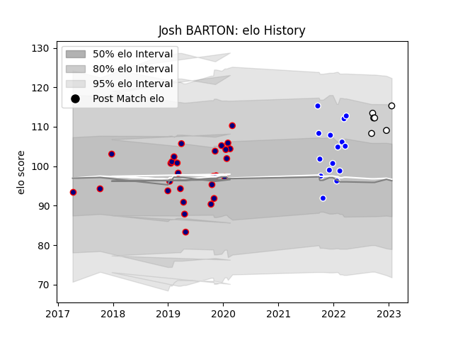

---  
layout: page  
title: Josh BARTON  
date: 2023-01-27 19:00:06.663192  
categories: player  
---
# Josh BARTON

## Positions: SH

## Current elo: 115.0

## Current Percentile: 87.0

# Elo History

# Match History

| Team              |   Appearances |   Win Rate |
|:------------------|--------------:|-----------:|
| London Scottish   |            28 |   0.357143 |
| Coventry          |            15 |   0.466667 |
| Newcastle Falcons |             6 |   0.333333 |

| Opponent            |   Matches |   Win Rate |
|:--------------------|----------:|-----------:|
| Ealing Trailfinders |         5 |   0        |
| Ampthill            |         4 |   0.375    |
| Cornish Pirates     |         4 |   0.5      |
| Jersey              |         4 |   0.5      |
| Bedford             |         4 |   0.625    |
| Hartpury College    |         4 |   0.25     |
| Doncaster           |         3 |   0.333333 |
| Nottingham          |         3 |   0.333333 |
| Richmond            |         3 |   0.666667 |
| Yorkshire Carnegie  |         3 |   0.666667 |
| Coventry            |         2 |   0.5      |
| Bristol Rugby       |         2 |   0.5      |
| Connacht            |         1 |   1        |
| Harlequins          |         1 |   0        |
| Cardiff Blues       |         1 |   0        |
| Leicester Tigers    |         1 |   0        |
| London Irish        |         1 |   0        |
| London Scottish     |         1 |   1        |
| Newcastle Falcons   |         1 |   0        |
| Worcester Warriors  |         1 |   0        |