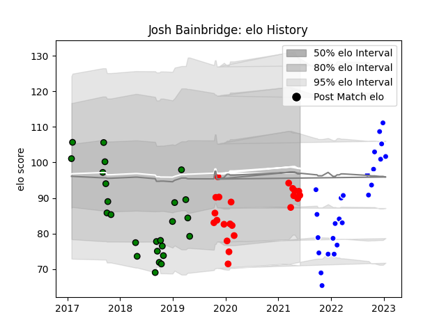

---  
layout: page  
title: Josh Bainbridge  
date: 2023-02-02 19:00:05.233265  
categories: player  
---
# Josh Bainbridge

## Positions: FL

## Current elo: 91.0

## Current Percentile: 24.0

# Elo History

# Match History

| Team               |   Appearances |   Win Rate |
|:-------------------|--------------:|-----------:|
| Coventry           |            26 |   0.557692 |
| Yorkshire Carnegie |            25 |   0.6      |
| Jersey             |            22 |   0.454545 |

| Opponent            |   Matches |   Win Rate |
|:--------------------|----------:|-----------:|
| Doncaster           |         8 |   0.75     |
| Ealing Trailfinders |         8 |   0.1875   |
| Hartpury College    |         8 |   0.5625   |
| Cornish Pirates     |         7 |   0.571429 |
| Bedford             |         7 |   0.714286 |
| London Scottish     |         7 |   0.571429 |
| Jersey              |         5 |   0.1      |
| Richmond            |         5 |   0.8      |
| Nottingham          |         5 |   0.8      |
| Coventry            |         4 |   0.5      |
| Newcastle Falcons   |         2 |   0        |
| Ampthill            |         2 |   0.5      |
| London Irish        |         1 |   0        |
| Caldy               |         1 |   1        |
| Rotherham Titans    |         1 |   1        |
| Saracens            |         1 |   0        |
| Yorkshire Carnegie  |         1 |   1        |