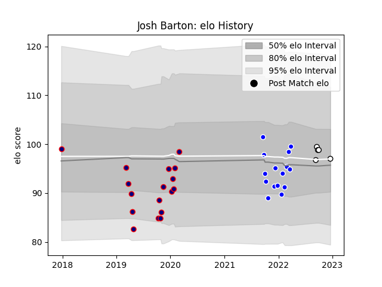

---  
layout: page  
title: Josh Barton  
date: 2022-12-18 16:28:30.666815  
categories: player  
---
# Josh Barton

## Positions: SH

## Current elo: 97.0

## Current Percentile: 65.0

# Elo History

# Match History

| Team              |   Appearances |   Win Rate |
|:------------------|--------------:|-----------:|
| London Scottish   |            17 |   0.411765 |
| Coventry          |            15 |   0.466667 |
| Newcastle Falcons |             5 |   0.2      |

| Opponent            |   Matches |   Win Rate |
|:--------------------|----------:|-----------:|
| Bedford             |         4 |   0.625    |
| Ampthill            |         3 |   0.5      |
| Ealing Trailfinders |         3 |   0        |
| Richmond            |         3 |   0.666667 |
| Jersey              |         3 |   0.333333 |
| Yorkshire Carnegie  |         3 |   0.666667 |
| Cornish Pirates     |         3 |   0.666667 |
| Doncaster           |         2 |   0.5      |
| Coventry            |         2 |   0.5      |
| Nottingham          |         2 |   0        |
| Hartpury College    |         2 |   0        |
| Harlequins          |         1 |   0        |
| Cardiff Blues       |         1 |   0        |
| Leicester Tigers    |         1 |   0        |
| London Scottish     |         1 |   1        |
| Newcastle Falcons   |         1 |   0        |
| Bristol Rugby       |         1 |   1        |
| Worcester Warriors  |         1 |   0        |