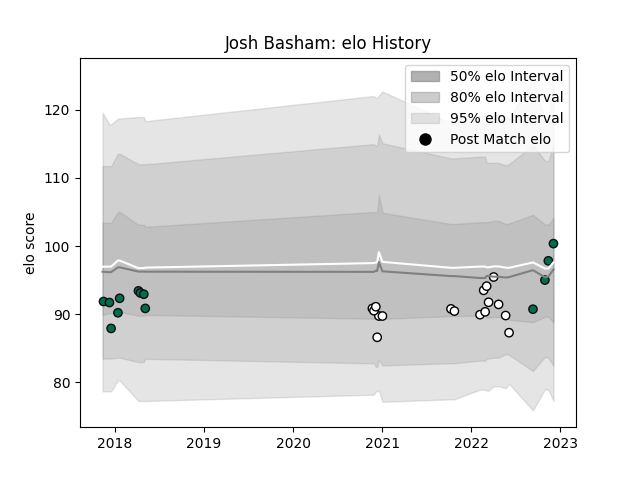

---  
layout: page  
title: Josh Basham  
date: 2023-01-06 00:24:11.975786  
categories: player  
---
# Josh Basham

## Positions: FL, N8

## Current elo: 108.0

## Current Percentile: 60.0

# Elo History

# Match History

| Team              |   Appearances |   Win Rate |
|:------------------|--------------:|-----------:|
| Newcastle Falcons |            17 |   0.294118 |
| London Irish      |            15 |   0.333333 |

| Opponent             |   Matches |   Win Rate |
|:---------------------|----------:|-----------:|
| Bath Rugby           |         3 |   0.333333 |
| Harlequins           |         3 |   0.333333 |
| Saracens             |         3 |   0        |
| Exeter Chiefs        |         3 |   0        |
| Gloucester Rugby     |         3 |   0        |
| Bristol Rugby        |         2 |   0        |
| Krasny Yar           |         2 |   1        |
| Worcester Warriors   |         2 |   1        |
| Edinburgh            |         1 |   0        |
| Castres Olympique    |         1 |   1        |
| London Irish         |         1 |   0        |
| Newcastle Falcons    |         1 |   1        |
| Northampton Saints   |         1 |   0        |
| Sale Sharks          |         1 |   1        |
| Cardiff Blues        |         1 |   0        |
| Stade Francais Paris |         1 |   0        |
| Stormers             |         1 |   0        |
| Wasps                |         1 |   1        |
| Leicester Tigers     |         1 |   0        |