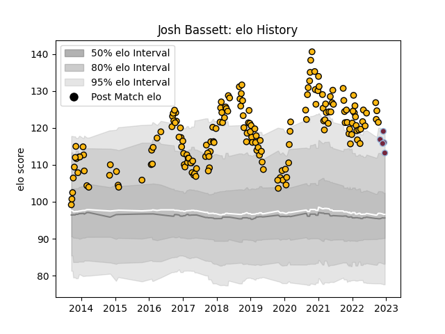

---  
layout: page  
title: Josh Bassett  
date: 2023-03-21 18:00:18.929746  
categories: player  
---
# Josh Bassett

Last updated: 2023-03-21
## Positions: W

## Current elo: 96.0

## Current Percentile: 70.0

# Elo History

# Match History

| Team       |   Appearances |   Win Rate |
|:-----------|--------------:|-----------:|
| Wasps      |           181 |   0.544199 |
| Harlequins |            13 |   0.461538 |

| Opponent            |   Matches |   Win Rate |
|:--------------------|----------:|-----------:|
| Gloucester Rugby    |        17 |   0.382353 |
| Exeter Chiefs       |        15 |   0.5      |
| Leicester Tigers    |        14 |   0.571429 |
| Northampton Saints  |        14 |   0.571429 |
| Sale Sharks         |        14 |   0.214286 |
| Bath Rugby          |        14 |   0.535714 |
| Bristol Rugby       |        13 |   0.615385 |
| London Irish        |        13 |   0.730769 |
| Worcester Warriors  |        13 |   0.923077 |
| Saracens            |        11 |   0.454545 |
| Newcastle Falcons   |        11 |   0.727273 |
| Harlequins          |        11 |   0.454545 |
| Stade Toulousain    |         5 |   0.5      |
| Leinster            |         4 |   0.25     |
| Edinburgh           |         3 |   0.333333 |
| Sharks              |         2 |   0.5      |
| Munster             |         2 |   0        |
| Zebre               |         2 |   1        |
| Grenoble            |         2 |   1        |
| Connacht            |         2 |   0.5      |
| Bordeaux Begles     |         2 |   0        |
| Lyon                |         1 |   0        |
| Montpellier Herault |         1 |   1        |
| Arix Viadana        |         1 |   1        |
| Dragons             |         1 |   1        |
| Racing 92           |         1 |   1        |
| Clermont Auvergne   |         1 |   0        |
| Cardiff Blues       |         1 |   0        |
| Ulster              |         1 |   0        |
| Bayonne             |         1 |   1        |
| Agen                |         1 |   1        |