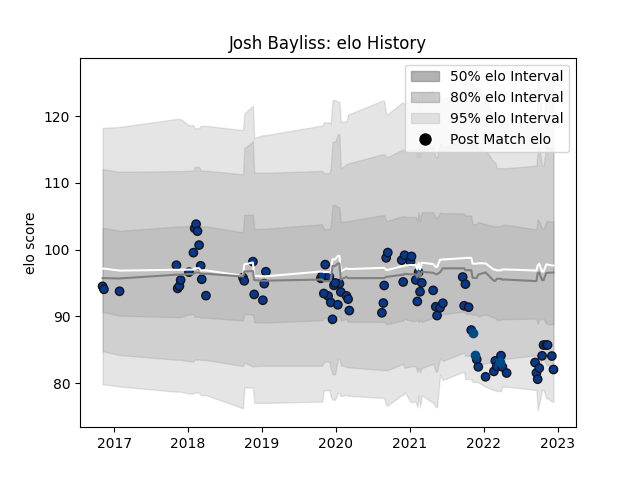

---  
layout: page  
title: Josh Bayliss  
date: 2023-03-17 17:17:15.480641  
categories: player  
---
# Josh Bayliss

## Positions: FL, N8

## Country: Scotland

## Current elo: 97.0

## Current Percentile: 59.0

# Elo History

# Match History

| Team       |   Appearances |   Win Rate |
|:-----------|--------------:|-----------:|
| Bath Rugby |            96 |   0.385417 |
| Scotland   |             3 |   0.666667 |

| Opponent           |   Matches |   Win Rate |
|:-------------------|----------:|-----------:|
| Northampton Saints |        10 |   0.7      |
| Harlequins         |         9 |   0.333333 |
| Exeter Chiefs      |         8 |   0.125    |
| Sale Sharks        |         8 |   0.5625   |
| Newcastle Falcons  |         8 |   0.5      |
| Bristol Rugby      |         8 |   0.125    |
| London Irish       |         7 |   0.714286 |
| Leicester Tigers   |         7 |   0.571429 |
| Wasps              |         6 |   0.166667 |
| Worcester Warriors |         5 |   0.8      |
| Saracens           |         4 |   0        |
| Ulster             |         2 |   0        |
| Toulon             |         2 |   0        |
| Leinster           |         2 |   0        |
| Gloucester Rugby   |         2 |   0.75     |
| Clermont Auvergne  |         2 |   0        |
| La Rochelle        |         1 |   0        |
| Japan              |         1 |   1        |
| Ospreys            |         1 |   1        |
| Ireland            |         1 |   0        |
| Scarlets           |         1 |   0        |
| Stade Toulousain   |         1 |   0        |
| Glasgow Warriors   |         1 |   0        |
| Edinburgh          |         1 |   0        |
| Australia          |         1 |   1        |