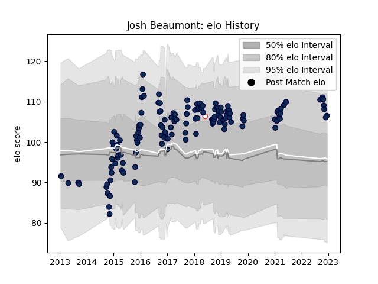

---  
layout: page  
title: Josh Beaumont  
date: 2023-03-21 17:55:53.055750  
categories: player  
---
# Josh Beaumont

Last updated: 2023-03-21
## Positions: N8, L

## Country: England

## Current elo: 112.0

## Current Percentile: 86.0

# Elo History

# Match History

| Team        |   Appearances |   Win Rate |
|:------------|--------------:|-----------:|
| Sale Sharks |           149 |   0.520134 |
| England     |             1 |   0        |

| Opponent            |   Matches |   Win Rate |
|:--------------------|----------:|-----------:|
| Saracens            |        14 |   0.214286 |
| Northampton Saints  |        13 |   0.384615 |
| Wasps               |        13 |   0.692308 |
| Harlequins          |        12 |   0.416667 |
| Gloucester Rugby    |        11 |   0.636364 |
| Leicester Tigers    |        11 |   0.636364 |
| Newcastle Falcons   |        10 |   0.4      |
| London Irish        |         9 |   0.777778 |
| Exeter Chiefs       |         9 |   0.222222 |
| Worcester Warriors  |         8 |   0.6875   |
| Bristol Rugby       |         7 |   0.642857 |
| Bath Rugby          |         6 |   0.416667 |
| Scarlets            |         4 |   0.75     |
| Dragons             |         2 |   0.5      |
| Connacht            |         2 |   1        |
| Castres Olympique   |         2 |   1        |
| Munster             |         2 |   0        |
| Bordeaux Begles     |         2 |   0.5      |
| Pau                 |         2 |   1        |
| Perpignan           |         2 |   1        |
| Toulon              |         1 |   0        |
| Stade Toulousain    |         1 |   0        |
| Ulster              |         1 |   1        |
| Barbarians          |         1 |   0        |
| Montpellier Herault |         1 |   0        |
| Lyon                |         1 |   1        |
| La Rochelle         |         1 |   0        |
| Clermont Auvergne   |         1 |   0        |
| London Welsh        |         1 |   1        |