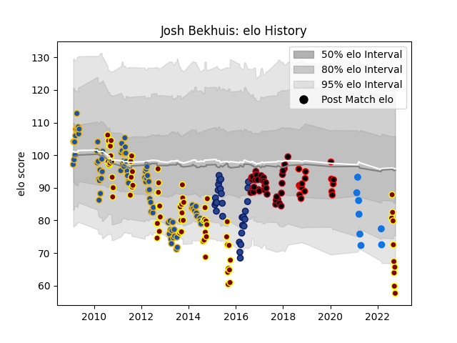

---  
layout: page  
title: Josh Bekhuis  
date: 2023-03-21 18:41:11.923846  
categories: player  
---
# Josh Bekhuis

Last updated: 2023-03-21
## Positions: L

## Current elo: 58.0

## Current Percentile: 4.0

# Elo History

# Match History

| Team                |   Appearances |   Win Rate |
|:--------------------|--------------:|-----------:|
| Highlanders         |            81 |   0.382716 |
| Southland           |            73 |   0.383562 |
| Lyon                |            38 |   0.473684 |
| Blues               |            28 |   0.375    |
| Mie Honda Heat      |            16 |   0.46875  |
| Shimizu Blue Sharks |             8 |   0.375    |

| Opponent                          |   Matches |   Win Rate |
|:----------------------------------|----------:|-----------:|
| Crusaders                         |        13 |   0.230769 |
| Chiefs                            |        13 |   0.230769 |
| Hurricanes                        |        11 |   0.363636 |
| Blues                             |         9 |   0.444444 |
| North Harbour                     |         7 |   0.714286 |
| Otago                             |         7 |   0.428571 |
| Brumbies                          |         7 |   0.428571 |
| Counties Manukau                  |         7 |   0.428571 |
| Cheetahs                          |         6 |   0.666667 |
| Hawke's Bay                       |         6 |   0.416667 |
| Northland                         |         6 |   0.5      |
| Sharks                            |         6 |   0.5      |
| Melbourne Rebels                  |         6 |   0.666667 |
| Stormers                          |         6 |   0        |
| New South Wales Waratahs          |         6 |   0.5      |
| Manawatu                          |         6 |   0.5      |
| Tasman                            |         6 |   0.166667 |
| Western Force                     |         6 |   0.166667 |
| Taranaki                          |         5 |   0        |
| Canterbury                        |         5 |   0.4      |
| Queensland Reds                   |         5 |   0.3      |
| Waikato                           |         5 |   0.4      |
| Wellington                        |         5 |   0        |
| Bay of Plenty                     |         5 |   0.4      |
| Lions                             |         5 |   0.4      |
| La Rochelle                       |         4 |   0.25     |
| Pau                               |         4 |   0.5      |
| Bulls                             |         4 |   0.75     |
| Stade Toulousain                  |         4 |   0.5      |
| Montpellier Herault               |         3 |   0.333333 |
| Auckland                          |         3 |   0.5      |
| Yokohama Canon Eagles             |         3 |   0.833333 |
| Bordeaux Begles                   |         3 |   0.666667 |
| Highlanders                       |         3 |   0.333333 |
| Castres Olympique                 |         3 |   0.666667 |
| Grenoble                          |         2 |   1        |
| Toulon                            |         2 |   0.5      |
| Stade Francais Paris              |         2 |   0.5      |
| Southern Kings                    |         2 |   0.5      |
| Clermont Auvergne                 |         2 |   0        |
| Toshiba Brave Lupus Tokyo         |         2 |   0.5      |
| Racing 92                         |         2 |   0.5      |
| Coca-Cola Red Sparks              |         2 |   0.5      |
| Cardiff Blues                     |         2 |   0        |
| Black Rams Tokyo                  |         2 |   0.5      |
| Bayonne                           |         2 |   0.75     |
| Kubota Spears Funabashi Tokyo-Bay |         2 |   0        |
| Toyota Industries Shuttles Aichi  |         1 |   0        |
| Toyota Verblitz                   |         1 |   0        |
| Urayasu D-Rocks                   |         1 |   0        |
| Brive                             |         1 |   0.5      |
| Kyuden Voltex                     |         1 |   1        |
| Shizuoka Blue Revs                |         1 |   0        |
| Chugoku Red Regulions             |         1 |   1        |
| Kurita Water Gush                 |         1 |   0        |
| Saitama Wild Knights              |         1 |   0        |
| Green Rockets Tokatsu             |         1 |   1        |
| Hanazono Kintetsu Liners          |         1 |   0        |
| Newcastle Falcons                 |         1 |   0        |
| Hino Red Dolphins                 |         1 |   0        |
| Munakata Sanix Blues              |         1 |   1        |
| Jaguares                          |         1 |   1        |
| Kamaishi Seawaves                 |         1 |   1        |
| Agen                              |         1 |   1        |