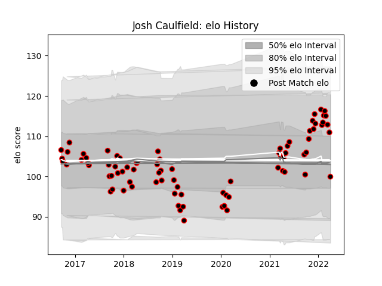

---  
layout: page  
title: Josh Caulfield  
date: 2022-12-12 15:08:29.010456  
categories: player  
---
# Josh Caulfield

## Positions: L, FL

## Current elo: 110.0

## Current Percentile: 85.0

# Elo History

# Match History

| Team            |   Appearances |   Win Rate |
|:----------------|--------------:|-----------:|
| Cornish Pirates |            71 |   0.549296 |

| Opponent            |   Matches |   Win Rate |
|:--------------------|----------:|-----------:|
| Jersey              |        10 |   0.2      |
| Nottingham          |         9 |   0.666667 |
| Doncaster           |         7 |   0.714286 |
| Bedford             |         7 |   0.785714 |
| Ealing Trailfinders |         6 |   0.166667 |
| Coventry            |         5 |   0.8      |
| Hartpury College    |         5 |   0.8      |
| Richmond            |         4 |   0.875    |
| London Scottish     |         4 |   0.5      |
| Ampthill            |         3 |   0.666667 |
| Yorkshire Carnegie  |         3 |   0.333333 |
| Bristol Rugby       |         2 |   0        |
| London Irish        |         2 |   0        |
| Newcastle Falcons   |         1 |   0        |
| London Welsh        |         1 |   1        |
| Rotherham Titans    |         1 |   1        |
| Saracens            |         1 |   1        |