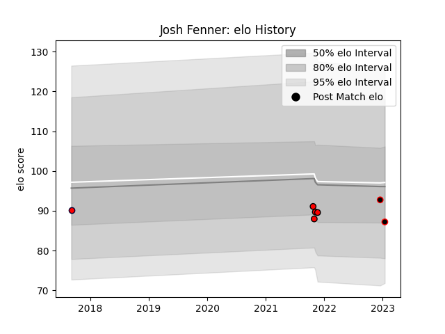

---  
layout: page  
title: Josh Fenner  
date: 2023-03-21 18:49:17.598177  
categories: player  
---
# Josh Fenner

Last updated: 2023-03-21
## Positions: FL, N8

## Current elo: 86.0

## Current Percentile: 13.0

# Elo History

# Match History

| Team                            |   Appearances |   Win Rate |
|:--------------------------------|--------------:|-----------:|
| Hartpury College                |             4 |       0.25 |
| NTT Docomo Red Hurricanes Osaka |             4 |       0.75 |
| Melbourne Rising                |             1 |       0    |

| Opponent            |   Matches |   Win Rate |
|:--------------------|----------:|-----------:|
| Kurita Water Gush   |         2 |        0.5 |
| Skyactivs Hiroshima |         2 |        1   |
| Bedford             |         1 |        0   |
| Doncaster           |         1 |        0   |
| Jersey              |         1 |        0   |
| London Scottish     |         1 |        1   |
| Perth Spirit        |         1 |        0   |