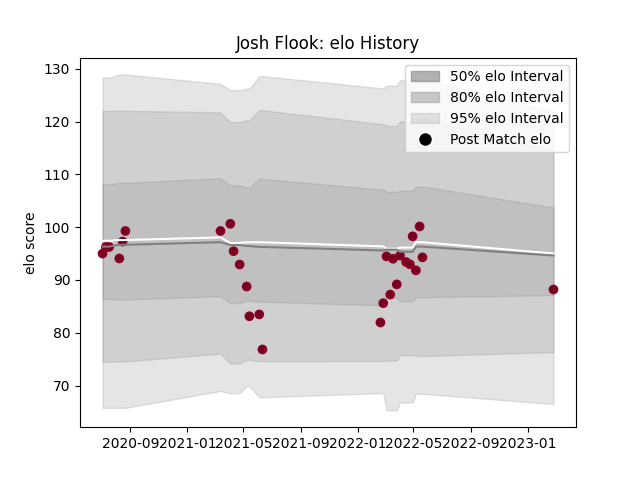

---  
layout: page  
title: Josh Flook  
date: 2023-03-17 17:30:25.177205  
categories: player  
---
# Josh Flook

## Positions: C, W

## Current elo: 103.0

## Current Percentile: 56.0

# Elo History

# Match History

| Team            |   Appearances |   Win Rate |
|:----------------|--------------:|-----------:|
| Queensland Reds |            30 |   0.583333 |

| Opponent                 |   Matches |   Win Rate |
|:-------------------------|----------:|-----------:|
| Brumbies                 |         6 |   0.666667 |
| Melbourne Rebels         |         5 |   0.9      |
| Western Force            |         5 |   0.8      |
| New South Wales Waratahs |         4 |   0.75     |
| Hurricanes               |         3 |   0        |
| Blues                    |         2 |   0        |
| Highlanders              |         2 |   0        |
| Chiefs                   |         1 |   0        |
| Fijian Drua              |         1 |   1        |
| Moana Pasifika           |         1 |   1        |