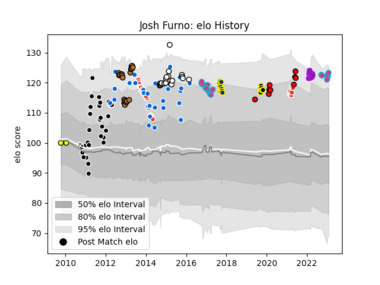

---  
layout: page  
title: Josh Furno  
date: 2023-02-02 18:42:34.253541  
categories: player  
---
# Josh Furno

## Positions: L, FL

## Country: Italy

## Current elo: 123.0

## Current Percentile: 93.0

# Elo History

# Match History

| Team               |   Appearances |   Win Rate |
|:-------------------|--------------:|-----------:|
| Italy              |            36 |  0.277778  |
| Aironi             |            33 |  0.121212  |
| Biarritz Olympique |            31 |  0.33871   |
| Zebre              |            26 |  0.0769231 |
| Newcastle Falcons  |            20 |  0.275     |
| Narbonne           |            19 |  0.394737  |
| Otago              |            10 |  0.4       |
| San Diego Legion   |             9 |  0.777778  |
| US Bressane        |             9 |  0.222222  |
| Wellington         |             6 |  0.666667  |
| Arix Viadana       |             2 |  0         |

| Opponent                   |   Matches |   Win Rate |
|:---------------------------|----------:|-----------:|
| Connacht                   |         8 |   0.375    |
| Oyonnax                    |         7 |   0.142857 |
| Scotland                   |         6 |   0.333333 |
| Cardiff Blues              |         5 |   0        |
| Munster                    |         5 |   0        |
| Scarlets                   |         5 |   0        |
| Leinster                   |         5 |   0        |
| Ulster                     |         5 |   0        |
| Ospreys                    |         4 |   0        |
| Sale Sharks                |         4 |   0.25     |
| Glasgow Warriors           |         4 |   0        |
| Dragons                    |         4 |   0.25     |
| Wasps                      |         4 |   0.125    |
| Wales                      |         4 |   0        |
| Northampton Saints         |         4 |   0.25     |
| Ireland                    |         4 |   0.25     |
| Stade Toulousain           |         4 |   0        |
| Aurillac                   |         3 |   1        |
| France                     |         3 |   0        |
| Leicester Tigers           |         3 |   0        |
| Argentina                  |         3 |   0        |
| Clermont Auvergne          |         3 |   0        |
| Beziers                    |         3 |   0.5      |
| Edinburgh                  |         3 |   0.333333 |
| England                    |         3 |   0        |
| Perpignan                  |         3 |   0        |
| London Welsh               |         2 |   1        |
| Montpellier Herault        |         2 |   0.5      |
| Nevers                     |         2 |   0.5      |
| London Irish               |         2 |   0        |
| Tasman                     |         2 |   0        |
| Northland                  |         2 |   0.5      |
| Tarbes                     |         2 |   0        |
| Pau                        |         2 |   0        |
| Racing 92                  |         2 |   0.5      |
| Samoa                      |         2 |   0.5      |
| Seattle Seawolves          |         2 |   0.5      |
| South Africa               |         2 |   0        |
| Massy                      |         2 |   0.5      |
| Worcester Warriors         |         2 |   1        |
| Canada                     |         2 |   1        |
| Fiji                       |         2 |   0.5      |
| Brive                      |         2 |   0.5      |
| Bayonne                    |         2 |   0        |
| Canterbury                 |         2 |   0.5      |
| Bay of Plenty              |         2 |   0        |
| Bath Rugby                 |         2 |   0        |
| Carcassonne                |         2 |   0.5      |
| Castres Olympique          |         2 |   0.25     |
| Colomiers                  |         2 |   0.5      |
| Exeter Chiefs              |         2 |   0.5      |
| Bordeaux Begles            |         2 |   0        |
| Gloucester Rugby           |         2 |   0        |
| Grenoble                   |         2 |   0.5      |
| Auckland                   |         2 |   1        |
| Vannes                     |         1 |   0        |
| Benetton Treviso           |         1 |   0        |
| Southland                  |         1 |   1        |
| Wellington                 |         1 |   0        |
| Stade Francais Paris       |         1 |   0        |
| Auch                       |         1 |   1        |
| Australia                  |         1 |   0        |
| Toulon                     |         1 |   0        |
| Utah Warriors              |         1 |   0        |
| United States of America   |         1 |   1        |
| Tonga                      |         1 |   1        |
| Toronto Arrows             |         1 |   1        |
| Sharks                     |         1 |   0        |
| Valence Romans Drome Rugby |         1 |   1        |
| La Rochelle                |         1 |   0        |
| Biarritz Olympique         |         1 |   1        |
| New England Free Jacks     |         1 |   1        |
| Houston SaberCats          |         1 |   1        |
| Manawatu                   |         1 |   1        |
| Albi                       |         1 |   1        |
| Mont-de-Marsan             |         1 |   0        |
| Hawke's Bay                |         1 |   1        |
| NOLA Gold                  |         1 |   1        |
| Narbonne                   |         1 |   0        |
| North Harbour              |         1 |   0        |
| Bristol Rugby              |         1 |   0        |
| Colorado Raptors           |         1 |   1        |
| Otago                      |         1 |   1        |
| Provence Rugby             |         1 |   0        |
| R.U. New York              |         1 |   1        |
| Romania                    |         1 |   1        |
| Japan                      |         1 |   0        |
| Saracens                   |         1 |   0        |
| Agen                       |         1 |   1        |