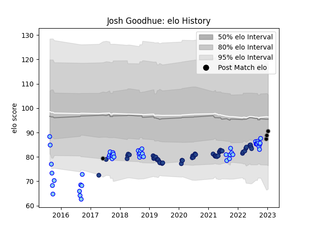

---  
layout: page  
title: Josh Goodhue  
date: 2023-03-21 18:17:48.352064  
categories: player  
---
# Josh Goodhue

Last updated: 2023-03-21
## Positions: L

## Country: Provincial Union XV

## Current elo: 91.0

## Current Percentile: 39.0

# Elo History

# Match History

| Team                |   Appearances |   Win Rate |
|:--------------------|--------------:|-----------:|
| Northland           |            49 |   0.285714 |
| Blues               |            47 |   0.510638 |
| Black Rams Tokyo    |             1 |   0        |
| Provincial Union XV |             1 |   0        |

| Opponent                 |   Matches |   Win Rate |
|:-------------------------|----------:|-----------:|
| Chiefs                   |         9 |   0.555556 |
| Hurricanes               |         8 |   0.375    |
| Highlanders              |         7 |   0.714286 |
| Crusaders                |         6 |   0.166667 |
| Manawatu                 |         6 |   0.333333 |
| Wellington               |         5 |   0.2      |
| Auckland                 |         4 |   0.25     |
| New South Wales Waratahs |         4 |   1        |
| Southland                |         4 |   0.5      |
| Taranaki                 |         4 |   0.5      |
| Bay of Plenty            |         4 |   0.5      |
| Waikato                  |         4 |   0.25     |
| Tasman                   |         3 |   0        |
| Otago                    |         3 |   0.333333 |
| North Harbour            |         3 |   0        |
| Sunwolves                |         3 |   0.666667 |
| Hawke's Bay              |         3 |   0.333333 |
| Counties Manukau         |         3 |   0.333333 |
| Canterbury               |         3 |   0        |
| Brumbies                 |         3 |   0.666667 |
| Sharks                   |         2 |   0        |
| Jaguares                 |         2 |   0        |
| Melbourne Rebels         |         1 |   1        |
| Queensland Reds          |         1 |   0        |
| Mitsubishi Dynaboars     |         1 |   0        |
| British and Irish Lions  |         1 |   0        |
| Western Force            |         1 |   1        |