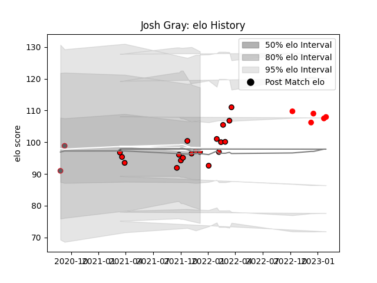

---  
layout: page  
title: Josh Gray  
date: 2023-02-02 18:48:39.420114  
categories: player  
---
# Josh Gray

## Positions: FL, N8

## Current elo: 97.0

## Current Percentile: 52.0

# Elo History

# Match History

| Team             |   Appearances |   Win Rate |
|:-----------------|--------------:|-----------:|
| Hartpury College |            19 |   0.315789 |
| Jersey           |             5 |   1        |
| Gloucester Rugby |             2 |   0        |

| Opponent            |   Matches |   Win Rate |
|:--------------------|----------:|-----------:|
| Bedford             |         3 |   0.666667 |
| Cornish Pirates     |         3 |   0.666667 |
| Doncaster           |         3 |   0        |
| Ealing Trailfinders |         3 |   0        |
| Nottingham          |         3 |   0.666667 |
| Jersey              |         2 |   0        |
| London Scottish     |         2 |   1        |
| Richmond            |         2 |   0.5      |
| Ampthill            |         1 |   0        |
| Caldy               |         1 |   1        |
| Coventry            |         1 |   1        |
| Exeter Chiefs       |         1 |   0        |
| Saracens            |         1 |   0        |