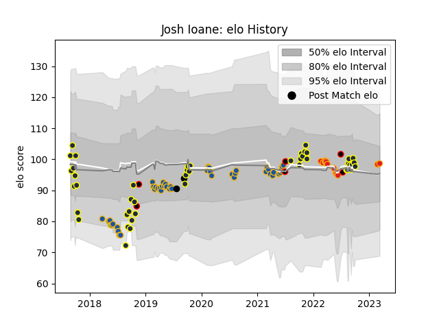

---  
layout: page  
title: Josh Ioane  
date: 2023-03-17 17:25:30.227465  
categories: player  
---
# Josh Ioane

## Positions: FH, FB

## Country: New Zealand Maori

## Current elo: 99.0

## Current Percentile: 57.0

# Elo History

# Match History

| Team              |   Appearances |   Win Rate |
|:------------------|--------------:|-----------:|
| Highlanders       |            45 |   0.444444 |
| Otago             |            45 |   0.488889 |
| Chiefs            |            12 |   0.75     |
| New Zealand Maori |             6 |   0.833333 |
| New Zealand       |             2 |   1        |

| Opponent                 |   Matches |   Win Rate |
|:-------------------------|----------:|-----------:|
| Crusaders                |         9 |   0.111111 |
| Hurricanes               |         7 |   0.428571 |
| Blues                    |         7 |   0.285714 |
| Chiefs                   |         6 |   0.583333 |
| Waikato                  |         5 |   0.6      |
| New South Wales Waratahs |         5 |   0.6      |
| Melbourne Rebels         |         5 |   0.6      |
| Hawke's Bay              |         5 |   0.6      |
| Manawatu                 |         5 |   0.8      |
| Canterbury               |         5 |   0.2      |
| Southland                |         4 |   1        |
| Northland                |         4 |   0.5      |
| Bay of Plenty            |         4 |   0.25     |
| Taranaki                 |         3 |   0        |
| Wellington               |         3 |   0        |
| Auckland                 |         3 |   0.666667 |
| Ireland                  |         2 |   0.5      |
| Lions                    |         2 |   0.5      |
| Highlanders              |         2 |   1        |
| Brumbies                 |         2 |   1        |
| Moana Pasifika           |         2 |   1        |
| Bulls                    |         2 |   0.25     |
| Tasman                   |         2 |   0.5      |
| Queensland Reds          |         2 |   1        |
| Samoa                    |         2 |   1        |
| Sharks                   |         2 |   0        |
| Tonga                    |         1 |   1        |
| United States of America |         1 |   1        |
| Argentina                |         1 |   1        |
| Sunwolves                |         1 |   1        |
| North Harbour            |         1 |   1        |
| Jaguares                 |         1 |   1        |
| Fijian Drua              |         1 |   1        |
| Counties Manukau         |         1 |   0        |
| Chile                    |         1 |   1        |
| Western Force            |         1 |   1        |