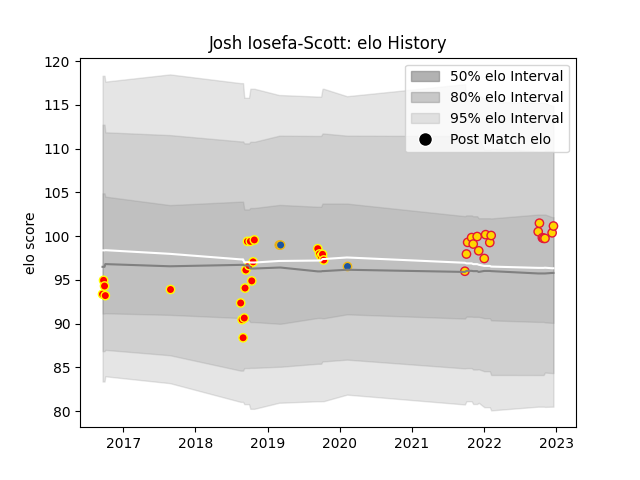

---  
layout: page  
title: Josh Iosefa-Scott  
date: 2023-01-06 00:25:36.849033  
categories: player  
---
# Josh Iosefa-Scott

## Positions: P

## Current elo: 111.0

## Current Percentile: 76.0

# Elo History

# Match History

| Team          |   Appearances |   Win Rate |
|:--------------|--------------:|-----------:|
| Waikato       |            22 |   0.477273 |
| Exeter Chiefs |            20 |   0.5      |
| Highlanders   |             3 |   0        |

| Opponent           |   Matches |   Win Rate |
|:-------------------|----------:|-----------:|
| Northland          |         3 |   0.666667 |
| Otago              |         3 |   0.333333 |
| Saracens           |         3 |   0.333333 |
| Taranaki           |         3 |   0.833333 |
| Northampton Saints |         2 |   0        |
| Bath Rugby         |         2 |   1        |
| Sale Sharks        |         2 |   0.5      |
| Hawke's Bay        |         2 |   0.5      |
| Gloucester Rugby   |         2 |   0.5      |
| Counties Manukau   |         2 |   0.5      |
| Bristol Rugby      |         2 |   1        |
| Wellington         |         2 |   0.5      |
| Southland          |         1 |   1        |
| Sharks             |         1 |   0        |
| Tasman             |         1 |   0        |
| Wasps              |         1 |   0        |
| Auckland           |         1 |   0        |
| Melbourne Rebels   |         1 |   0        |
| North Harbour      |         1 |   0        |
| Newcastle Falcons  |         1 |   0        |
| Manawatu           |         1 |   0        |
| London Irish       |         1 |   0        |
| Hurricanes         |         1 |   0        |
| Harlequins         |         1 |   0        |
| Castres Olympique  |         1 |   1        |
| Canterbury         |         1 |   0        |
| Bulls              |         1 |   1        |
| Bay of Plenty      |         1 |   1        |
| Worcester Warriors |         1 |   1        |