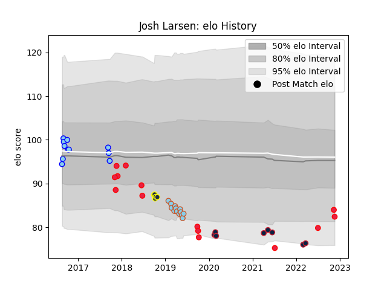

---  
layout: page  
title: Josh Larsen  
date: 2023-02-24 02:21:10.370500  
categories: player  
---
# Josh Larsen

## Positions: L

## Country: Canada

## Current elo: 71.0

## Current Percentile: 10.0

# Elo History

# Match History

| Team                   |   Appearances |   Win Rate |
|:-----------------------|--------------:|-----------:|
| New England Free Jacks |            38 |   0.631579 |
| Canada                 |            16 |   0.25     |
| Austin Elite Rugby     |            15 |   0        |
| Northland              |            11 |   0.181818 |
| Otago                  |             5 |   0.6      |

| Opponent                 |   Matches |   Win Rate |
|:-------------------------|----------:|-----------:|
| Rugby New York           |         7 |   0.428571 |
| R.U. New York            |         7 |   0.428571 |
| NOLA Gold                |         7 |   0.428571 |
| Seattle Seawolves        |         5 |   0.4      |
| Old Glory DC             |         4 |   0.75     |
| Waikato                  |         4 |   0.75     |
| Utah Warriors            |         4 |   0.5      |
| Toronto Arrows           |         4 |   0.5      |
| San Diego Legion         |         4 |   0.25     |
| Houston SaberCats        |         3 |   0.333333 |
| Rugby ATL                |         3 |   0.666667 |
| North Harbour            |         2 |   0        |
| Austin Gilgronis         |         2 |   1        |
| Auckland                 |         2 |   0.5      |
| Bay of Plenty            |         2 |   0.5      |
| Belgium                  |         2 |   1        |
| Manawatu                 |         2 |   0        |
| L. A. Giltinis           |         2 |   0        |
| Netherlands              |         1 |   1        |
| South Africa             |         1 |   0        |
| Uruguay                  |         1 |   0        |
| United States of America |         1 |   0        |
| Canterbury               |         1 |   0        |
| Tasman                   |         1 |   0        |
| Spain                    |         1 |   1        |
| Southland                |         1 |   0        |
| Georgia                  |         1 |   0        |
| Fiji                     |         1 |   0        |
| New Zealand              |         1 |   0        |
| Russia                   |         1 |   0        |
| Glendale Raptors         |         1 |   0        |
| Italy                    |         1 |   0        |
| Portugal                 |         1 |   0        |
| Otago                    |         1 |   0        |
| Namibia                  |         1 |   0        |
| New Zealand Maori        |         1 |   0        |
| Wales                    |         1 |   0        |