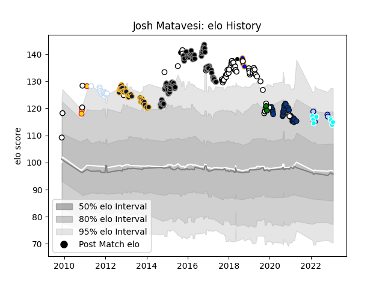

---  
layout: page  
title: Josh Matavesi  
date: 2023-03-21 18:50:20.282187  
categories: player  
---
# Josh Matavesi

Last updated: 2023-03-21
## Positions: C

## Country: Fiji

## Current elo: 123.0

## Current Percentile: 92.0

# Elo History

# Match History

| Team                             |   Appearances |   Win Rate |
|:---------------------------------|--------------:|-----------:|
| Ospreys                          |            78 |   0.647436 |
| Newcastle Falcons                |            46 |   0.565217 |
| Worcester Warriors               |            40 |   0.225    |
| Bath Rugby                       |            28 |   0.589286 |
| Fiji                             |            19 |   0.342105 |
| Racing 92                        |            14 |   0.392857 |
| Bedford                          |             6 |   0.5      |
| Doncaster                        |             4 |   0.5      |
| Toyota Industries Shuttles Aichi |             4 |   1        |
| Exeter Chiefs                    |             3 |   0.666667 |
| Yorkshire Carnegie               |             2 |   0        |
| Barbarians                       |             1 |   1        |
| Northampton Saints               |             1 |   1        |

| Opponent                 |   Matches |   Win Rate |
|:-------------------------|----------:|-----------:|
| Exeter Chiefs            |        12 |   0.166667 |
| Leicester Tigers         |        11 |   0.363636 |
| Northampton Saints       |        10 |   0.4      |
| London Irish             |        10 |   0.5      |
| Wasps                    |         9 |   0.333333 |
| Sale Sharks              |         9 |   0.555556 |
| Gloucester Rugby         |         8 |   0.5625   |
| Benetton Treviso         |         8 |   0.75     |
| Saracens                 |         8 |   0.3125   |
| Cardiff Blues            |         8 |   0.625    |
| Dragons                  |         7 |   1        |
| Scarlets                 |         7 |   0.428571 |
| Harlequins               |         7 |   0.428571 |
| Connacht                 |         6 |   0.666667 |
| Newcastle Falcons        |         6 |   0.5      |
| Munster                  |         6 |   0.5      |
| Worcester Warriors       |         6 |   0.833333 |
| Bath Rugby               |         6 |   0.5      |
| Glasgow Warriors         |         6 |   0.583333 |
| Leinster                 |         5 |   0.1      |
| Zebre                    |         5 |   1        |
| Edinburgh                |         5 |   0.8      |
| Bristol Rugby            |         5 |   0.2      |
| England                  |         4 |   0.25     |
| Wales                    |         4 |   0.125    |
| Bordeaux Begles          |         4 |   0.75     |
| Lyon                     |         3 |   1        |
| Ealing Trailfinders      |         3 |   0.666667 |
| Coventry                 |         3 |   0.333333 |
| Cornish Pirates          |         3 |   0.333333 |
| Hartpury College         |         3 |   1        |
| Ulster                   |         3 |   0.333333 |
| Clermont Auvergne        |         3 |   0.333333 |
| Perpignan                |         2 |   0.75     |
| Racing 92                |         2 |   0.25     |
| Richmond                 |         2 |   0.5      |
| Toulon                   |         2 |   0        |
| Shimizu Blue Sharks      |         2 |   1        |
| Stade Francais Paris     |         2 |   0        |
| Uruguay                  |         2 |   0.5      |
| Biarritz Olympique       |         2 |   0.5      |
| Oyonnax                  |         2 |   0.75     |
| Agen                     |         2 |   1        |
| New Zealand Maori        |         2 |   0        |
| Grenoble                 |         2 |   1        |
| Brive                    |         1 |   1        |
| Stade Toulousain         |         1 |   0        |
| Bayonne                  |         1 |   0        |
| France                   |         1 |   0        |
| Georgia                  |         1 |   1        |
| United States of America |         1 |   1        |
| Jersey                   |         1 |   0        |
| Kyuden Voltex            |         1 |   1        |
| Tonga                    |         1 |   1        |
| Australia                |         1 |   0        |
| Canada                   |         1 |   1        |
| Chugoku Red Regulions    |         1 |   1        |
| Scotland                 |         1 |   0        |
| Bizkaia Gernika RT       |         1 |   1        |
| London Welsh             |         1 |   1        |
| Montpellier Herault      |         1 |   0        |
| Romania                  |         1 |   1        |
| Castres Olympique        |         1 |   1        |
| Nottingham               |         1 |   1        |