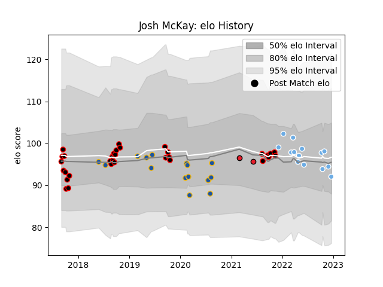

---  
layout: page  
title: Josh McKay  
date: 2022-12-18 16:25:24.619163  
categories: player  
---
# Josh McKay

## Positions: W, FB

## Current elo: 92.0

## Current Percentile: 46.0

# Elo History

# Match History

| Team             |   Appearances |   Win Rate |
|:-----------------|--------------:|-----------:|
| Canterbury       |            32 |   0.6875   |
| Highlanders      |            15 |   0.466667 |
| Glasgow Warriors |            14 |   0.428571 |
| Crusaders        |             2 |   1        |

| Opponent                 |   Matches |   Win Rate |
|:-------------------------|----------:|-----------:|
| Auckland                 |         4 |   0.25     |
| Wellington               |         4 |   0.25     |
| Bulls                    |         4 |   0.375    |
| North Harbour            |         4 |   1        |
| Manawatu                 |         3 |   0.666667 |
| Waikato                  |         3 |   0.666667 |
| Tasman                   |         3 |   0.666667 |
| Melbourne Rebels         |         3 |   0.333333 |
| Edinburgh                |         2 |   0.5      |
| Hawke's Bay              |         2 |   1        |
| Leinster                 |         2 |   0        |
| Chiefs                   |         2 |   0.75     |
| Bay of Plenty            |         2 |   1        |
| Southland                |         2 |   1        |
| Crusaders                |         2 |   0        |
| Otago                    |         2 |   1        |
| Sharks                   |         2 |   0        |
| Counties Manukau         |         1 |   1        |
| Scarlets                 |         1 |   0        |
| Benetton Treviso         |         1 |   1        |
| Blues                    |         1 |   0        |
| Brumbies                 |         1 |   1        |
| Taranaki                 |         1 |   0        |
| Stormers                 |         1 |   0        |
| Ospreys                  |         1 |   1        |
| Queensland Reds          |         1 |   1        |
| Perpignan                |         1 |   1        |
| Northland                |         1 |   1        |
| Cardiff Blues            |         1 |   0        |
| New South Wales Waratahs |         1 |   1        |
| Hurricanes               |         1 |   1        |
| Highlanders              |         1 |   1        |
| Dragons                  |         1 |   1        |
| Western Force            |         1 |   1        |