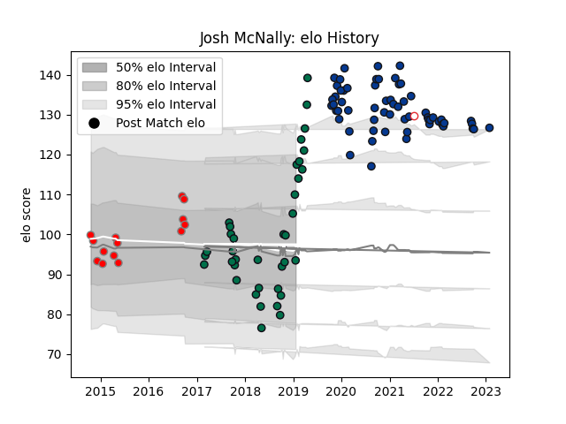

---  
layout: page  
title: Josh McNally  
date: 2023-03-17 17:40:07.023360  
categories: player  
---
# Josh McNally

## Positions: L, FL

## Country: England

## Current elo: 92.0

## Current Percentile: 64.0

# Elo History

# Match History

| Team         |   Appearances |   Win Rate |
|:-------------|--------------:|-----------:|
| Bath Rugby   |            69 |   0.34058  |
| London Irish |            38 |   0.657895 |
| London Welsh |            14 |   0.142857 |
| England      |             1 |   1        |

| Opponent                 |   Matches |   Win Rate |
|:-------------------------|----------:|-----------:|
| Leicester Tigers         |         9 |  0.333333  |
| Exeter Chiefs            |         8 |  0.125     |
| Wasps                    |         8 |  0         |
| Harlequins               |         8 |  0.625     |
| Sale Sharks              |         7 |  0.428571  |
| Saracens                 |         7 |  0.0714286 |
| London Irish             |         6 |  0.5       |
| Bristol Rugby            |         6 |  0         |
| Worcester Warriors       |         5 |  1         |
| Northampton Saints       |         5 |  0.4       |
| Cornish Pirates          |         4 |  0.75      |
| Yorkshire Carnegie       |         4 |  0.5       |
| London Scottish          |         4 |  1         |
| Gloucester Rugby         |         3 |  0.333333  |
| Jersey                   |         3 |  0.666667  |
| Newcastle Falcons        |         3 |  0.333333  |
| Ulster                   |         2 |  0         |
| Lyon                     |         2 |  0         |
| Richmond                 |         2 |  1         |
| Nottingham               |         2 |  1         |
| Bath Rugby               |         2 |  0         |
| Bedford                  |         2 |  1         |
| Hartpury College         |         2 |  1         |
| Edinburgh                |         2 |  0         |
| Doncaster                |         2 |  1         |
| Coventry                 |         2 |  1         |
| Clermont Auvergne        |         2 |  0         |
| Montpellier Herault      |         1 |  0         |
| Leinster                 |         1 |  0         |
| La Rochelle              |         1 |  0         |
| Rotherham Titans         |         1 |  0         |
| Ealing Trailfinders      |         1 |  1         |
| Scarlets                 |         1 |  0         |
| Stade Francais Paris     |         1 |  1         |
| United States of America |         1 |  1         |
| Bordeaux Begles          |         1 |  0         |
| Zebre                    |         1 |  1         |