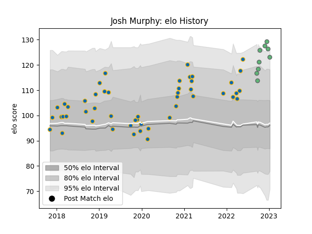

---  
layout: page  
title: Josh Murphy  
date: 2023-01-13 11:24:54.938663  
categories: player  
---
# Josh Murphy

## Positions: FL, L

## Current elo: 123.0

## Current Percentile: 95.0

# Elo History

# Match History

| Team     |   Appearances |   Win Rate |
|:---------|--------------:|-----------:|
| Leinster |            49 |   0.785714 |
| Connacht |             9 |   0.333333 |

| Opponent          |   Matches |   Win Rate |
|:------------------|----------:|-----------:|
| Ulster            |         8 |   0.625    |
| Glasgow Warriors  |         6 |   0.666667 |
| Zebre             |         5 |   1        |
| Munster           |         5 |   0.8      |
| Ospreys           |         5 |   0.6      |
| Scarlets          |         4 |   0.625    |
| Edinburgh         |         4 |   0.5      |
| Connacht          |         3 |   1        |
| Dragons           |         3 |   1        |
| Southern Kings    |         3 |   1        |
| Cardiff Blues     |         2 |   1        |
| Stormers          |         2 |   0        |
| Sharks            |         2 |   0.5      |
| Benetton Treviso  |         1 |   1        |
| Newcastle Falcons |         1 |   1        |
| Bulls             |         1 |   0        |
| Lions             |         1 |   1        |
| Leinster          |         1 |   0        |
| Lyon              |         1 |   1        |