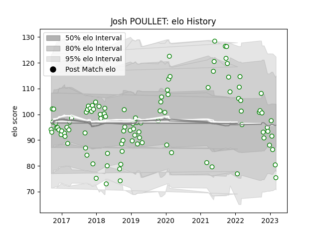

---  
layout: page  
title: Josh POULLET  
date: 2023-03-27 11:36:27.140706  
categories: player  
---
# Josh POULLET

Last updated: 2023-03-27
## Positions: N8, FL

## Current elo: 84.0

## Current Percentile: 11.0

# Elo History

# Match History

| Team       |   Appearances |   Win Rate |
|:-----------|--------------:|-----------:|
| Nottingham |           106 |   0.377358 |

| Opponent            |   Matches |   Win Rate |
|:--------------------|----------:|-----------:|
| Cornish Pirates     |        12 |   0.25     |
| Ealing Trailfinders |        11 |   0.272727 |
| Richmond            |        10 |   0.6      |
| Bedford             |        10 |   0.4      |
| Jersey              |         9 |   0.166667 |
| Doncaster           |         9 |   0.333333 |
| Hartpury College    |         8 |   0.5      |
| London Scottish     |         8 |   0.75     |
| Yorkshire Carnegie  |         7 |   0.285714 |
| Coventry            |         5 |   0.5      |
| London Irish        |         4 |   0        |
| Ampthill            |         4 |   0.5      |
| Rotherham Titans    |         3 |   1        |
| Bristol Rugby       |         2 |   0        |
| Caldy               |         1 |   0        |
| London Welsh        |         1 |   0        |
| Newcastle Falcons   |         1 |   0        |
| Saracens            |         1 |   0        |