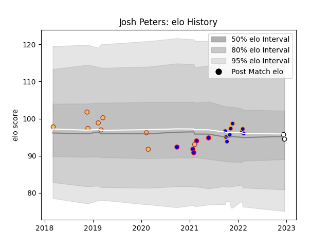

---  
layout: page  
title: Josh Peters  
date: 2023-01-17 11:37:24.256608  
categories: player  
---
# Josh Peters

## Positions: L

## Country: Spain

## Current elo: 85.0

## Current Percentile: 77.0

# Elo History

# Match History

| Team              |   Appearances |   Win Rate |
|:------------------|--------------:|-----------:|
| Doncaster         |            18 |   0.833333 |
| Dijon             |            14 |   0.357143 |
| Spain             |            10 |   0.5      |
| Newcastle Falcons |             3 |   0        |

| Opponent                   |   Matches |   Win Rate |
|:---------------------------|----------:|-----------:|
| Romania                    |         3 |   0.333333 |
| Jersey                     |         2 |   1        |
| Dax                        |         2 |   0        |
| Richmond                   |         2 |   1        |
| London Scottish            |         2 |   1        |
| Ampthill                   |         2 |   1        |
| Hartpury College           |         2 |   1        |
| Georgia                    |         2 |   0        |
| Ealing Trailfinders        |         2 |   1        |
| US Bressane                |         2 |   0        |
| Cognac Saint Jean d'Angély |         2 |   0        |
| Cardiff Blues              |         2 |   0        |
| Bedford                    |         2 |   0.5      |
| Cornish Pirates            |         2 |   0.5      |
| Coventry                   |         1 |   0        |
| Portugal                   |         1 |   1        |
| Tarbes                     |         1 |   1        |
| Suresnes                   |         1 |   1        |
| Samoa                      |         1 |   0        |
| Russia                     |         1 |   1        |
| Bourgoin-Jallieu           |         1 |   0        |
| Nice                       |         1 |   0        |
| Nottingham                 |         1 |   1        |
| Narbonne                   |         1 |   1        |
| Namibia                    |         1 |   1        |
| Massy                      |         1 |   1        |
| Chambery                   |         1 |   1        |
| Germany                    |         1 |   1        |
| Connacht                   |         1 |   0        |
| Albi                       |         1 |   0        |