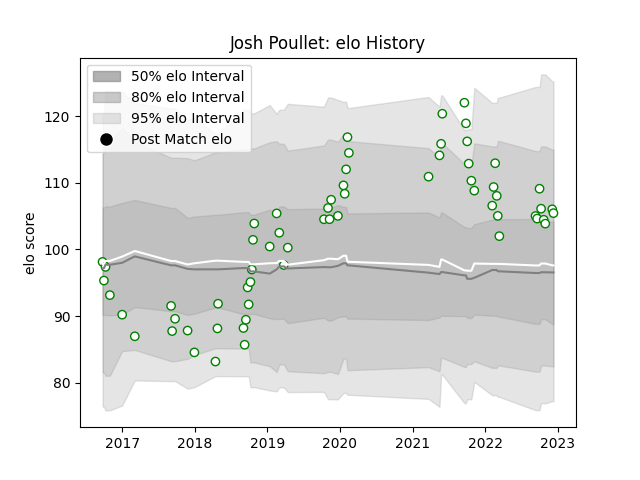

---  
layout: page  
title: Josh Poullet  
date: 2022-12-18 16:29:35.384924  
categories: player  
---
# Josh Poullet

## Positions: N8, FL

## Current elo: 105.0

## Current Percentile: 79.0

# Elo History

# Match History

| Team       |   Appearances |   Win Rate |
|:-----------|--------------:|-----------:|
| Nottingham |            62 |   0.451613 |

| Opponent            |   Matches |   Win Rate |
|:--------------------|----------:|-----------:|
| Bedford             |         7 |   0.428571 |
| Doncaster           |         7 |   0.428571 |
| Jersey              |         7 |   0.142857 |
| Richmond            |         7 |   0.571429 |
| Cornish Pirates     |         6 |   0.166667 |
| London Scottish     |         5 |   0.8      |
| Coventry            |         4 |   0.5      |
| Hartpury College    |         4 |   0.75     |
| Ampthill            |         3 |   0.666667 |
| Ealing Trailfinders |         3 |   0.333333 |
| Yorkshire Carnegie  |         3 |   0.666667 |
| London Irish        |         2 |   0        |
| Rotherham Titans    |         2 |   1        |
| Bristol Rugby       |         1 |   0        |
| Newcastle Falcons   |         1 |   0        |