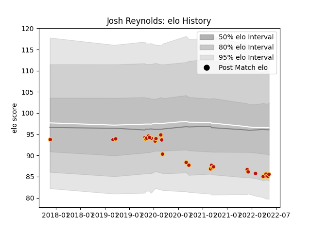

---  
layout: page  
title: Josh Reynolds  
date: 2023-01-17 11:45:27.379246  
categories: player  
---
# Josh Reynolds

## Positions: P

## Current elo: 81.0

## Current Percentile: None

# Elo History

# Match History

| Team    |   Appearances |   Win Rate |
|:--------|--------------:|-----------:|
| Dragons |            29 |   0.327586 |

| Opponent           |   Matches |   Win Rate |
|:-------------------|----------:|-----------:|
| Glasgow Warriors   |         4 |   0.5      |
| Scarlets           |         4 |   0.5      |
| Ospreys            |         3 |   0.333333 |
| Zebre              |         3 |   0        |
| Benetton Treviso   |         2 |   0.25     |
| Edinburgh          |         2 |   0        |
| RC Enisei          |         2 |   1        |
| Ulster             |         2 |   0        |
| Worcester Warriors |         2 |   0.5      |
| Bristol Rugby      |         1 |   0        |
| Bulls              |         1 |   0        |
| Castres Olympique  |         1 |   0        |
| Cheetahs           |         1 |   1        |
| Leinster           |         1 |   0        |