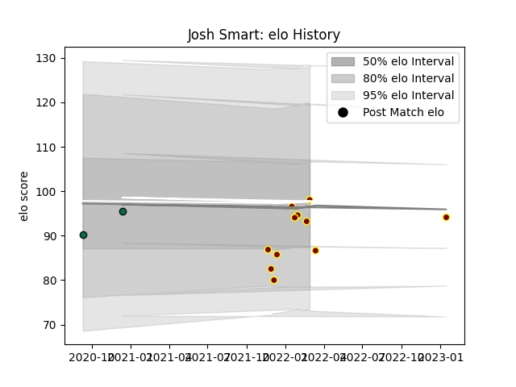

---  
layout: page  
title: Josh Smart  
date: 2023-01-21 15:45:39.025806  
categories: player  
---
# Josh Smart

## Positions: FL

## Current elo: 98.0

## Current Percentile: 45.0

# Elo History

# Match History

| Team         |   Appearances |   Win Rate |
|:-------------|--------------:|-----------:|
| Ampthill     |            11 |   0.363636 |
| London Irish |             2 |   0.5      |

| Opponent            |   Matches |   Win Rate |
|:--------------------|----------:|-----------:|
| Ealing Trailfinders |         3 |        0   |
| Hartpury College    |         2 |        0.5 |
| Richmond            |         2 |        1   |
| Agen                |         1 |        1   |
| Bedford             |         1 |        1   |
| Cornish Pirates     |         1 |        0   |
| Doncaster           |         1 |        0   |
| Harlequins          |         1 |        0   |
| Jersey              |         1 |        0   |