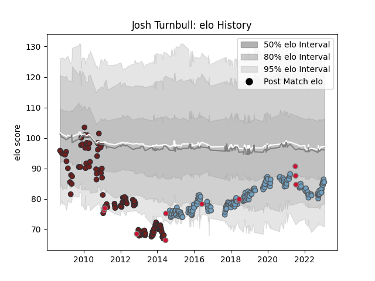

---  
layout: page  
title: Josh Turnbull  
date: 2022-12-14 11:27:54.196657  
categories: player  
---
# Josh Turnbull

## Positions: FL, L

## Country: Wales

## Current elo: 98.0

## Current Percentile: 52.0

# Elo History

# Match History

| Team          |   Appearances |   Win Rate |
|:--------------|--------------:|-----------:|
| Cardiff Blues |           175 |   0.488571 |
| Scarlets      |           116 |   0.443966 |
| Wales         |            10 |   0.55     |

| Opponent             |   Matches |   Win Rate |
|:---------------------|----------:|-----------:|
| Leinster             |        21 |  0.119048  |
| Ospreys              |        21 |  0.0952381 |
| Glasgow Warriors     |        21 |  0.238095  |
| Dragons              |        21 |  0.857143  |
| Munster              |        20 |  0.375     |
| Connacht             |        20 |  0.625     |
| Benetton Treviso     |        19 |  0.684211  |
| Ulster               |        19 |  0.263158  |
| Edinburgh            |        17 |  0.352941  |
| Scarlets             |        14 |  0.571429  |
| Zebre                |        12 |  0.791667  |
| Cardiff Blues        |        10 |  0.6       |
| Harlequins           |         7 |  0.214286  |
| Cheetahs             |         5 |  0.6       |
| Argentina            |         5 |  0.5       |
| London Irish         |         4 |  0.5       |
| Pau                  |         4 |  0.75      |
| Leicester Tigers     |         4 |  0         |
| Lyon                 |         4 |  1         |
| Clermont Auvergne    |         4 |  0         |
| Aironi               |         3 |  1         |
| Brive                |         3 |  0.666667  |
| Northampton Saints   |         3 |  0         |
| Racing 92            |         2 |  0.75      |
| Stormers             |         2 |  0.5       |
| Stade Francais Paris |         2 |  0.5       |
| Southern Kings       |         2 |  1         |
| Sharks               |         2 |  1         |
| Saracens             |         2 |  0         |
| Sale Sharks          |         2 |  0.5       |
| Grenoble             |         2 |  1         |
| Rovigo               |         2 |  1         |
| Perpignan            |         2 |  0.5       |
| Bulls                |         2 |  0         |
| Calvisano            |         2 |  1         |
| Montpellier Herault  |         2 |  0.5       |
| Lions                |         2 |  0         |
| Gloucester Rugby     |         2 |  1         |
| Newcastle Falcons    |         1 |  1         |
| Canada               |         1 |  1         |
| Scotland             |         1 |  1         |
| South Africa         |         1 |  0         |
| England              |         1 |  0         |
| Stade Toulousain     |         1 |  1         |
| Bristol Rugby        |         1 |  1         |
| Wasps                |         1 |  1         |
| Worcester Warriors   |         1 |  1         |
| Italy                |         1 |  1         |